# Driver Behavior Analytics Reference Implementation
## Overview

The Driver Behavior Analytics Reference Implementation uses video
injection and analytics, rule engine, and event recording services to
monitor driver behavior. Develop the solution that provides alerts and
stored video clips to drivers and fleet managers with this reference
implementation.

Select [Configure & Download](https://software.intel.com/iot/edgesoftwarehub/download/home/ri/driver_behavior_analytics) to download the reference implementation and the software listed below.

[Configure & Download](https://software.intel.com/iot/edgesoftwarehub/download/home/ri/driver_behavior_analytics)

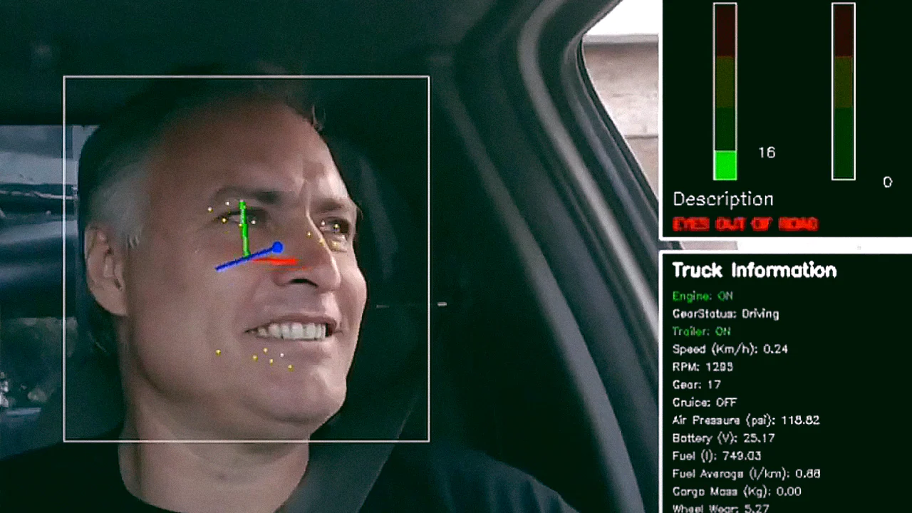

-  **Time to Complete:** Approximately 60 minutes
-  **Programming Language:** C++, Python*
-  **Available Software:** Intel® Distribution of OpenVINO™ toolkit 2021.4.752 Release


### Recommended Hardware

The below hardware is recommended for use with this reference implementation. See the [Recommended Hardware](https://www.intel.com/content/www/us/en/developer/topic-technology/edge-5g/edge-solutions/hardware.html?s=Newest) page for other suggestions. 

-   [ADLINK MXE-5500 Series](https://www.adlinktech.com/Products/Industrial_PCs_Fanless_Embedded_PCs/IntegratedFanlessEmbeddedComputers/MXE-5500_Series?lang=en)

-   [NEXCOM VTC 7252-7C4IP](https://www.nexcomusa.com/Products/mobile-computing-solutions/in-vehicle-pc/security-vtc/in-vehicle-computer-vtc-vtc-7252-7c4ip)

## Target System Requirements

-   Ubuntu* 20.04 LTS

-   6th to 10th Generation Intel® Core™ processors with Intel® Iris® Plus graphics or Intel® HD Graphics

## How It Works

The application uses the inference engine included in the Intel®
Distribution of OpenVINO™ toolkit and is designed to detect and track
driver behavior and driver actions to ensure safe driving.

Using deep learning models, video streams, and analytics running on
in-vehicle computers, it detects driver’s drowsiness states and
distraction behaviors, and provides real time alerts to driver, and
analytics per driver, truck and route over time.

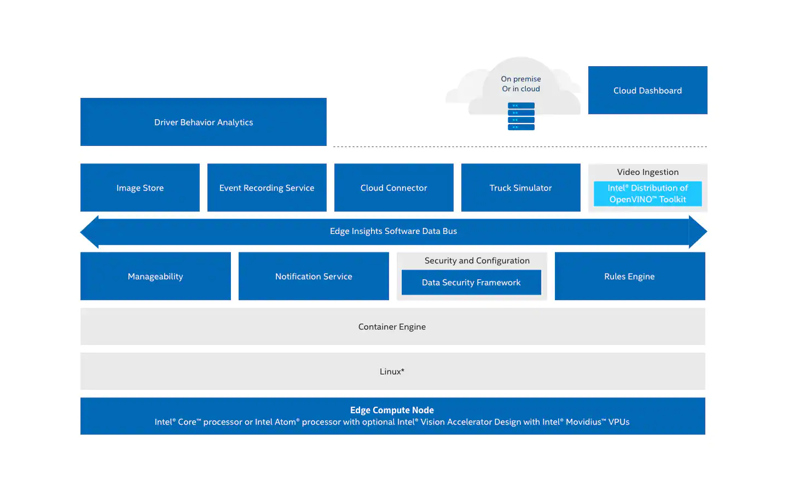

Figure 1: Architecture Diagram


## Get Started

### Step 1: Install the Reference Implementation

Select [Configure & Download](https://software.intel.com/iot/edgesoftwarehub/download/home/ri/driver_behavior_analytics) to download the reference implementation and then follow the steps below to install it.

[Configure & Download](https://software.intel.com/iot/edgesoftwarehub/download/home/ri/driver_behavior_analytics)

>**NOTE:** If the host system already has Docker* images and containers,
you might encounter errors while building the reference implementation
packages. If you do encounter errors, refer to the
[Troubleshooting](#troubleshooting)
section at the end of this document before starting the reference
implementation installation.

1. Open a new terminal, go to the downloaded folder and unzip the downloaded RI package.

   ```bash
   unzip driver_behavior_analytics.zip
   ```

2. Go to the `driver_behavior_analytics/` directory.

   ```bash
   cd driver_behavior_analytics/
   ```

3. Change permission of the executable *edgesoftware* file.

   ```bash
   chmod 755 edgesoftware
   ```

4. Run the command below to install the Reference Implementation.

   ```bash
   ./edgesoftware install
   ```

5. During the installation, you will be prompted for the **Product Key**. The
   **Product Key** is contained in the email you received from Intel confirming
   your download.

   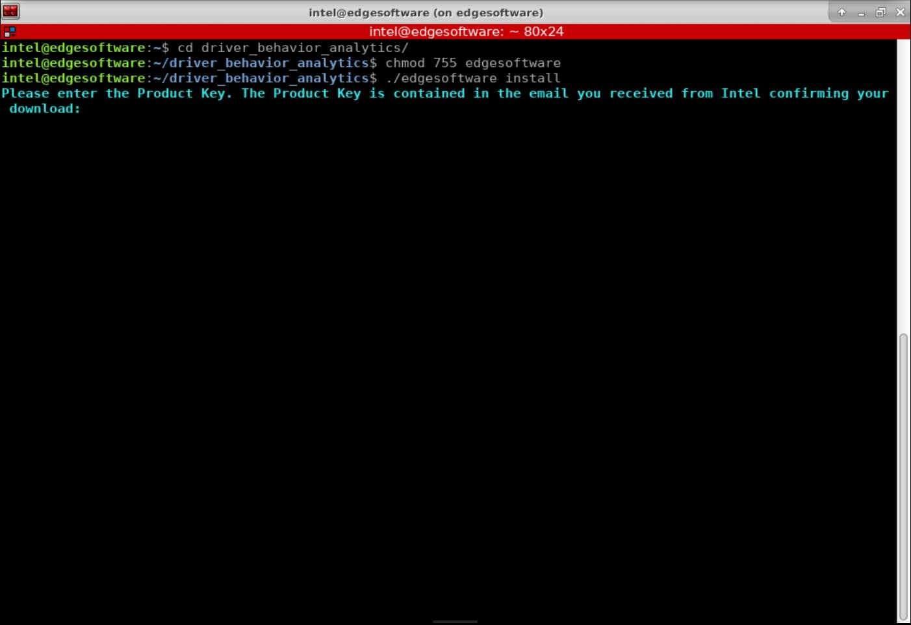

   Figure 2: Product Key

6. When the installation is complete, you see the message "Installation of
   package complete" and the installation status for each module.

   

   Figure 3: Installation Success

   >**NOTE:** If you encounter any issues, please refer to the
[Troubleshooting](#troubleshooting)
section at the end of this document. Installation failure logs will be
available at the path: 
`/var/log/esb-cli/Driver_Behavior_Analytics_<version>/output.log`

7. To start the application, change the directory using the cd command printed
   at the end of the installation process:

   ```bash
   cd <INSTALL_PATH>/driver_behavior_analytics/Driver_Behavior_Analytics_<version>/Driver_Behavior_Analytics/EII-DriverBehavior-UseCase
   ```

### Step 2: Run the Application

#### Prerequisites

- [Set Up ThingsBoard* Cloud Data](https://www.intel.com/content/www/us/en/develop/documentation/edge-insights-fleet-doc/top/reference-implementations/set-up-thingsboard-cloud-data.html)
- [Set Up Amazon Web Services* Cloud Storage](https://www.intel.com/content/www/us/en/develop/documentation/edge-insights-fleet-doc/top/reference-implementations/set-up-amazon-web-services-cloud-storage.html)

1. Run the application:

   Copy and run the `make webui` command from the end of the installation log:

   ```bash
   make webui EII_BASE=<INSTALL_PATH>/driver_behavior_analytics/Driver_Behavior_Analytics_<version>/IEdgeInsights REPO_FOLDER=<INSTALL_PATH>/driver_behavior_analytics/Driver_Behavior_Analytics_<version>/Driver_Behavior_Analytics/EII-DriverBehavior-UseCase
   ```

   For example:

   ```bash
   make webui EII_BASE=/home/intel/driver_behavior_analytics/Driver_Behavior_Analytics_2022.2/IEdgeInsights REPO_FOLDER=/home/intel/driver_behavior_analytics/Driver_Behavior_Analytics_2022.2/Driver_Behavior_Analytics/EII-DriverBehavior-UseCase
   ```

2. Open the Web UI: Go to **127.0.0.1:9092** on your web browser.

   

   Figure 4: Reference Implementation Dashboard

3. If you installed your ThingsBoard Cloud Server and you have enabled S3 Bucket
Server on your AWS account, you can provide your configured **AWS Access Key
ID**, **AWS Secret Access Key**, **AWS S3 Bucket Name** **Thingsboard IP**,
**Thingsboard Port** and **Thingsboard Device token** on the **Cloud Data
Configuration** tab. After you complete the Cloud configuration, make sure you
click on the **Save Credentials** and **Save Token** buttons.

   Now you can import the ThingsBoard dashboard as described at the end of the [Set Up ThingsBoard* Cloud Data](https://www.intel.com/content/www/us/en/develop/documentation/edge-insights-fleet-doc/top/reference-implementations/set-up-thingsboard-cloud-data.html) to enable all dashboard features, including the cloud storage.

   

   Figure 5: Configuration Tab Contents

   > **NOTE:** If you don't have an AWS account, you will not be able to access Storage Cloud. You can still enable the Thingsboard Cloud Data if you configured it locally or on another machine.

4. On the **Driver** tab, set up a driver for the use case.

   Go to the video samples directory.

   ```bash
   <INSTALL_PATH>/driver_behavior_analytics/Driver_Behavior_Analytics_<version>/Driver_Behavior_Analytics/EII-DriverBehavior-UseCase/config/VideoIngestion/test_videos/
   ```

   Open the video sample you will use to run the use case with your preferred
   video player. Make a screenshot profile picture of the driver's face.

   Access the **Driver** tab on the dashboard. In **Settings**, add the profile
   picture and a driver name. Click on the **Add Driver** button.

   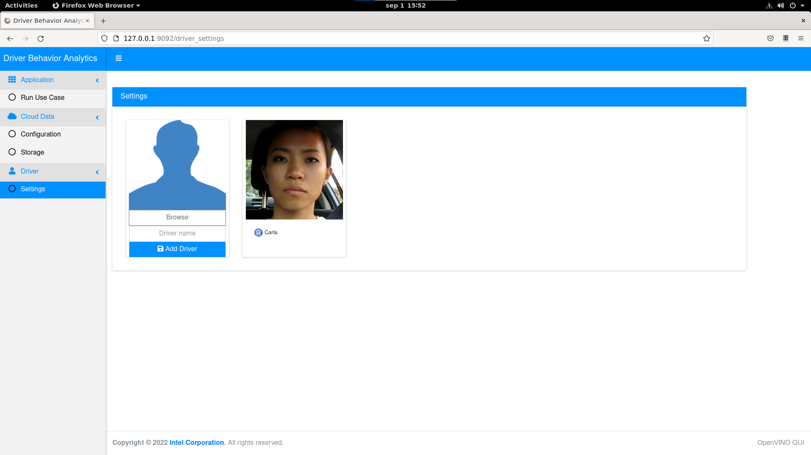

   Figure 6: Driver Tab Contents


5. Access the Driver Behavior Analytics Dashboard with the following steps.

   -  Go to sidebar and select **Run Use Case**.

      

      Figure 7: Select Run Use Case Tab

   -  Configure the use case by selecting the video sample and the device for
      all UDF models.

   -  Optionally, you can also set the simulation data that you want to use. You
      can choose between using the [KnowGo
      Simulator](https://www.intel.com/content/www/us/en/develop/documentation/edge-insights-fleet-doc/top/reference-implementations/set-up-know-go-simulator.html)
      or simply use the CSV pre-recorded simulation data.

   #### Model Descriptions

   - Head Pose: Estimates the head(s) position in the video frame.
   - Facial Landmarks: Determines the facial landmarks of the identified people.
   - Face Detection: Detects the face(s) in the video frame.
   - Face Re-identification: Recognizes persons using the provided faces.

      

      Figure 8: Configure Use Case

   -  Click on the **Browse** button and search for one of the sample videos
    delivered with the application at the following path:
    `<INSTALL_PATH>/driver_behavior_analytics/Driver_Behavior_Analytics_<version>/Driver_Behavior_Analytics/EII-DriverBehavior-UseCase/config/VideoIngestion/test_videos/`
   and select one of the two available.

      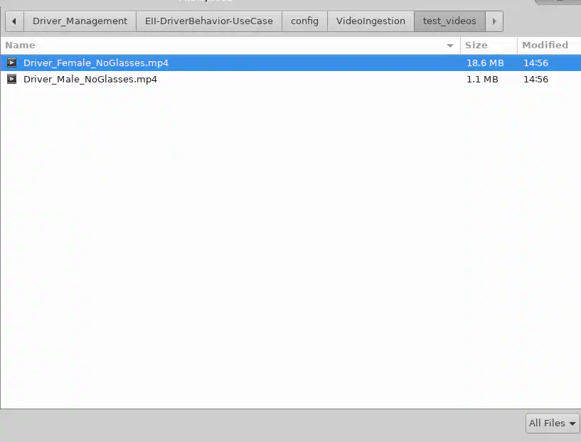

      Figure 9: Select Sample Video

   -  After selecting the video sample, select the device for all UDF models. Options include CPU, GPU, or HETERO:CPU,GPU. Click on **Run Use Case.**

       >**NOTE:** To use a GPU or a HETERO:CPU,GPU combination device, you must set the proper group for the GPU device with the command:
       >
       > `sudo chown root:video /dev/dri/renderD128`

   -  The application will start the Visualizer App that will detect yawns,
      blinks, drowsiness, distraction status and will display the name of the
      driver as in the following image:

      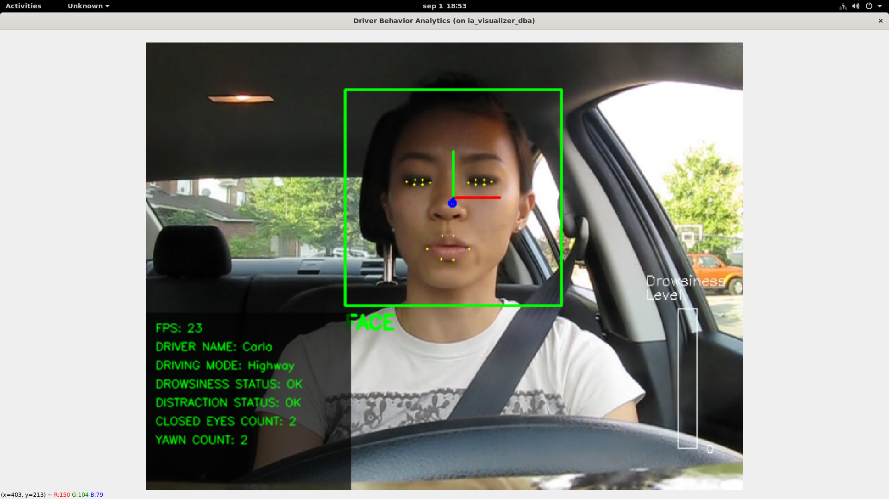

      Figure 10: Visualizer Output


6. After the visualizer starts, you can go to the ThingsBoard link and check the
alerts sent by the reference implementation, the driver name and the profile
picture previously added. If you configured the AWS credentials, you will also
have access to video snapshots taken by the application on the video stream.

   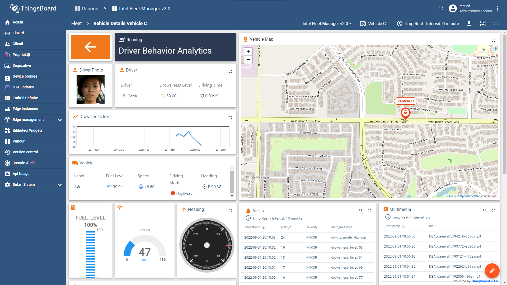

   Figure 11: Intel Fleet Manager Dashboard shown in ThingsBoard


7. You can also check the cloud storage from the Reference Implementation
   **Storage** tab.

   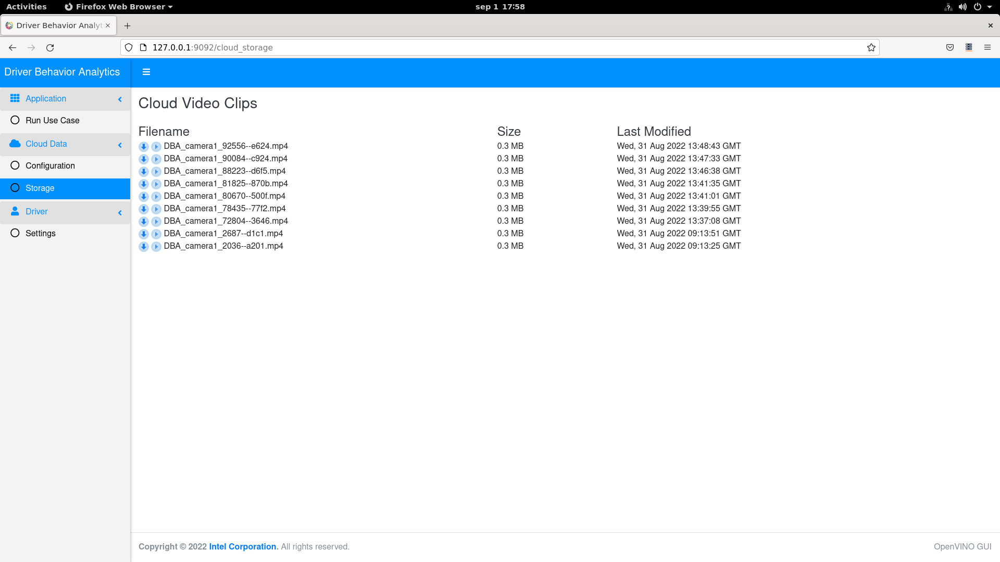

   Figure 12: Reference Implementation Storage Tab

## Run in Parallel with Vehicle Event Recording Reference Implementation

To run this task, you will need to download and install [Vehicle Event Recording](https://www.intel.com/content/www/us/en/developer/articles/reference-implementation/vehicle-event-recording.html) Reference Implementation.

### Prerequisites

-   Two terminals

-   Follow the steps to install [Vehicle Event Recording](https://www.intel.com/content/www/us/en/develop/articles/vehicle-event-recording.html#install) after installing [Driver Behavior Analytics](#step-1-install-the-reference-implementation)

### Steps to Run the Application

1. Change directory to **Driver Behavior Analytics Use Case** path on terminal 1:

   ```bash
   cd <INSTALL_PATH>/driver_behavior_analytics/Driver_Behavior_Analytics_<version>/Driver_Behavior_Analytics/EII-DriverBehavior-UseCase
   ```

   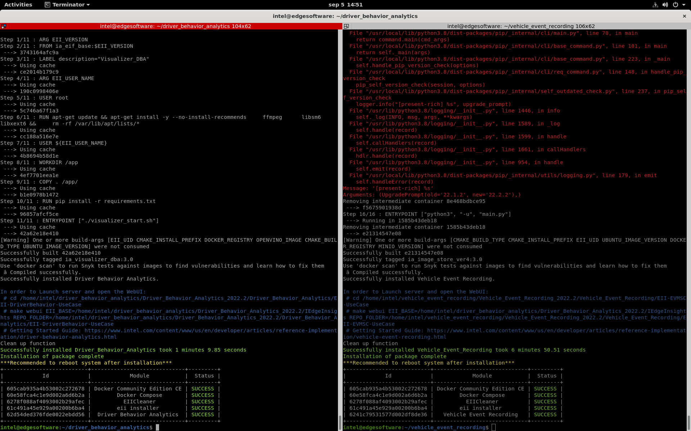

   Figure 13: Set Up System Console Windows

2. Change directory to **Vehicle Event Recording Use Case** path on terminal 2:

   ```bash
   cd <INSTALL_PATH>/vehicle_event_recording/Vehicle_Event_Recording_<version>/Vehicle_Event_Recording/EII-EVMSC-UseCase
   ```

   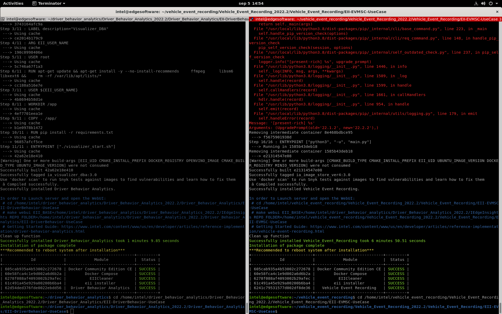

   Figure 14: System Console Windows Displaying Different Directories

3. Run the following command on terminal 1 to start the webserver application.

   Copy and run the `make webui` command from the end of the installation log:

   ```bash
   make webui EII_BASE=<INSTALL_PATH>/driver_behavior_analytics/Driver_Behavior_Analytics_<version>/IEdgeInsights REPO_FOLDER=<INSTALL_PATH>/driver_behavior_analytics/Driver_Behavior_Analytics_<version>/Driver_Behavior_Analytics/EII-DriverBehavior-UseCase
   ```

4. Run the following command on terminal 2 to start the webserver application.

   Copy and run the `make webui` command from the end of the installation log:

   ```bash
   make webui EII_BASE=<INSTALL_PATH>/driver_behavior_analytics/Driver_Behavior_Analytics_<version>/IEdgeInsights REPO_FOLDER=<INSTALL_PATH>/vehicle_event_recording/Vehicle_Event_Recording_<version>/Vehicle_Event_Recording/EII-EVMSC-UseCase
   ```

   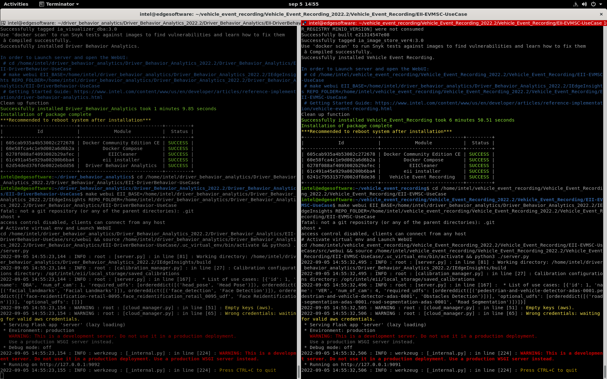

   Figure 15: System Console Windows Running Different Applications

5. Open your browser and go to **127.0.0.1:9092**.

6. Configure **Driver Behavior Analytics** by setting the **video source**, the
   **target** and click on **Run Use Case**.

7. Wait for Visualizer to get up and running.

8. Open the **Vehicle Event Recording** page by going to address **127.0.0.1:9091**.

9. Configure all available cameras with the desired videos and set the target
   for each one (**CPU** or **GPU**) and click **Run Use Case**.

   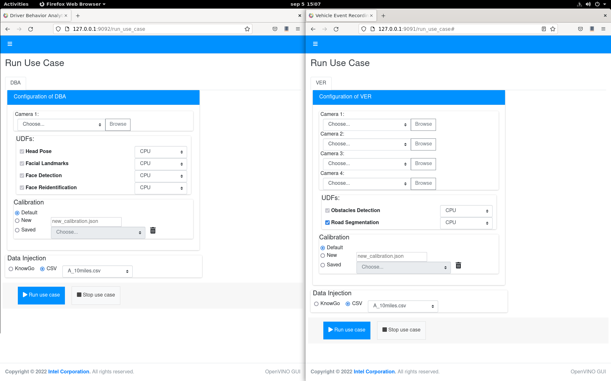

   Figure 16: Set Up Reference Implementation Dashboards

At this point, Driver Behavior Analytics will close and then both use cases will start.

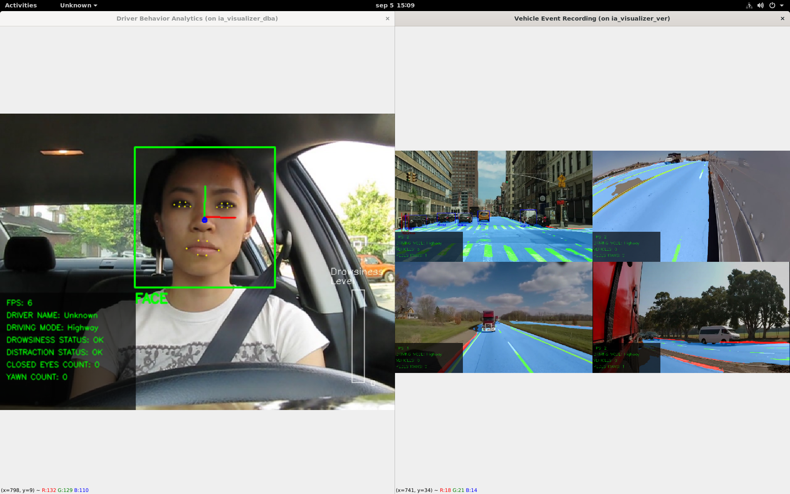

Figure 17: Visualizer Output for 2 Reference Implementations

>NOTE: If you reinstall the first reference implementation, you must reinstall the second reference implementation.

## Summary and Next Steps

This application successfully implements Intel® Distribution of OpenVINO™ toolkit plugins for detecting and tracking driver behavior. It
can be extended further to provide support for feed from network stream (RTSP camera), and the algorithm can be optimized for better
performance.

As a next step, try the following:

Use deep learning models and driver facing camera video streams to detect
driver’s drowsiness, distraction state and behaviors to provide real time alerts
to driver. This reference implementation uses Intel® Distribution of OpenVINO™
toolkit Open Model Zoo pre-trained models and 3rd party models, but you can
extend it to use your own models.

## Learn More

To continue your learning, see the following guides and software resources:

-   [Intel® Distribution of OpenVINO™ toolkit documentation](http://docs.openvinotoolkit.org/2019_R3/index.html)

## Known Issues

### Uninstall Reference Implementation

If you uninstall one of the reference implementations, you need to reinstall the other ones because the Docker images will be cleared.

## Troubleshooting

### Installation Failure

If the host system already has Docker images and its containers running, you will have issues during the RI installation.
You must stop/force stop existing containers and images.

-  To remove all stopped containers, dangling images, and unused networks:

   ```bash
   sudo docker system prune --volumes
   ```

-  To stop Docker containers:

   ```bash
   sudo docker stop $(sudo docker ps -aq)
   ```

-  To remove Docker containers:

   ```bash
   sudo docker rm $(sudo docker ps -aq)
   ```

-  To remove all Docker images:

   ```bash
   sudo docker rmi -f $(sudo docker images -aq)
   ```

### Docker Image Build Failure

If Docker image build on corporate network fails, follow the steps below.

1. Get DNS server using the command:

   ```bash
   nmcli dev show | grep 'IP4.DNS'
   ```

2. Configure Docker to use the server. Paste the line below in the `/etc/docker/daemon.json` file:

   ```bash
   { "dns": ["<dns-server-from-above-command>"]}
   ```

3. Restart Docker:

   ```bash
   sudo systemctl daemon-reload && sudo systemctl restart docker
   ```

### Installation Failure Due to Ubuntu Timezone Setting

While building the reference implementation, if you see `/etc/timezone && apt-get install -y tzdata && ln -sf
/usr/share/zoneinfo/${HOST_TIME_ZONE} /etc/localtime && dpkg-reconfigure -f noninteractive tzdata' returned a non-zero code: 1 make: ***
[config] Error 1`

Run the following command in your terminal:

```bash
sudo timedatectl set-local-rtc 0
```

### Installation Encoding Issue

While building the reference implementation, if you see `ERROR: 'latin-1' codec can't encode character '\\u2615' in position 3: ordinal not in range(256)`

Run the following command in your terminal:

```bash
export LANG=en_US.UTF-8
```

### Can't Connect to Docker Daemon

If you can't connect to docker daemon at http+docker://localhost, run the following command in your terminal:

```bash
sudo usermod -aG docker $USER
```

Log out and log back in to Ubuntu.

Check before retrying to install if group Docker is available for you by running the following command in a terminal:

```bash
groups
```

The output should contain “docker”.

### Support Forum
If you're unable to resolve your issues, contact the [Support Forum](https://software.intel.com/en-us/forums/intel-edge-software-recipes).
