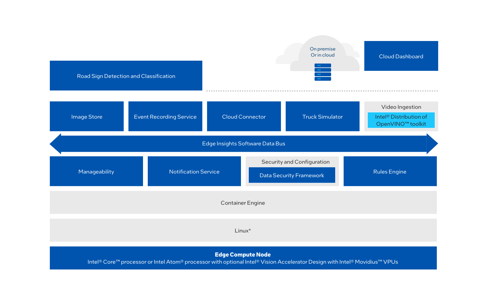

# Road Sign Detection and Classification Reference Implementation
## Overview

XXX The Road Sign Detection and Classification Reference Implementation monitors the exterior of a
vehicle and send alerts to Cloud Dashboard. It uses a camera placed in the front
of the vehicle facing forward to detect and recognize traffic signs while
driving. The OpenVINO™ Semantic Segmentation model is able to detect and
classify the traffic signs, and the Signs Recognition model is also implemented
for this Use Case, allowing the vehicle to recognize different traffic signs
placed on the road, such as speed limits, no entry, turn left or right ahead,
road work, pedestrians, children crossing, no passing of heavy vehicles, etc.

>**Disclaimer**\
This proof of concept demonstration shows how to use Edge Insights for Fleet
middleware. This model is provided for demonstration purposes only. We strongly
recommend developers use an appropriate model validated for their context of
use. In this example, one model detects Road Signs visible to a vehicles’
front-facing camera, and another classifies/recognizes those Signs. The proof of
concept demonstration also uploads JPEG snapshots of video frames containing
signs to Amazon Web Services* (AWS*) cloud servers, to validate that detection
events have been triggered accurately.

Select **Configure & Download** to download the reference implementation and the software listed below.

[Configure & Download](https://software.intel.com/iot/edgesoftwarehub/download/home/ri/road_sign_detection_and_classification)

>**Legal Disclaimers**\
Recipient is solely responsible for compliance with all applicable regulatory standards and safety, privacy, and security related requirements concerning Recipient's use of the Intel hardware and software.\
Recipient is solely responsible for any and all integration tasks, functions, and performance in connection with use of the Intel hardware or software as part of a larger system. Intel does not have sufficient knowledge of any adjoining, connecting, or component parts used with or possibly impacted by the Intel hardware or software or information about operating conditions or operating environments in which the Intel hardware or software may be used by Recipient.  Intel bears no responsibility, liability, or fault for any integration issues associated with the inclusion of the Intel hardware or software into a system.  It is Recipient’s responsibility to design, manage, and assure safeguards to anticipate, monitor, and control component, system, quality, and or safety failures.


-  **Time to Complete:** Approximately 60 minutes
-  **Programming Language:** Python*
-  **Available Software:** Intel® Distribution of OpenVINO™ toolkit 2021.4.2 Release


### Recommended Hardware

The below hardware is recommended for use with this reference implementation.
For other suggestions, see [Recommended
Hardware](https://www.intel.com/content/www/us/en/developer/topic-technology/edge-5g/edge-solutions/hardware.html?s=Newest).

-   [ADLINK MXE-5500 Series](https://www.adlinktech.com/Products/Industrial_PCs_Fanless_Embedded_PCs/IntegratedFanlessEmbeddedComputers/MXE-5500_Series?lang=en)

-   [NEXCOM VTC 7252-7C4IP](https://www.nexcomusa.com/Products/mobile-computing-solutions/in-vehicle-pc/security-vtc/in-vehicle-computer-vtc-vtc-7252-7c4ip)

## Target System Requirements

-   Ubuntu* 20.04 LTS

-   6th to 10th Generation Intel® Core™ processors with Intel® Iris® Plus graphics or Intel® HD Graphics

## How It Works


The reference implementation contains a full pipeline of analytics on video
streams from IP cameras mounted inside a car area with a front angle and a
computer using an Intel® Core™ processor or an Intel Atom® processor onboard the
bus. Pretrained models are used to inference, detect and classify road signs.

This reference implementation contains a notification subsystem which includes a cloud
dashboard and a cloud storage for the bus operator and fleet manager.




Figure 1: Architecture Diagram

## Get Started

### Step 1: Install the Reference Implementation

Select **Configure & Download** to download the reference implementation and
then follow the steps below to install it.

>**NOTE:** The images provided in the reference implementation are ONLY to be used
for validating the accuracy of detection events.

[Configure & Download](https://software.intel.com/iot/edgesoftwarehub/download/home/ri/road_sign_detection_and_classification)

>**NOTE:** If the host system already has Docker* images and containers,
you might encounter errors while building the reference implementation
packages. If you do encounter errors, refer to the
[Troubleshooting](#troubleshooting)
section at the end of this document before starting the reference
implementation installation.

1. Open a new terminal, go to the downloaded folder and unzip the downloaded RI package.

    ```bash
    unzip road_sign_detection_and_classification.zip
    ```

2. Go to the `road_sign_detection_and_classification/` directory.

    ```bash
    cd road_sign_detection_and_classification/
    ```

3. Change permission of the executable *edgesoftware* file.

    ```bash
    chmod 755 edgesoftware
    ```

4. Run the command below to install the Reference Implementation.

    ```bash
    ./edgesoftware install
    ```

5. During the installation, you will be prompted for the **Product Key**. The
   **Product Key** is contained in the email you received from Intel confirming
   your download.

    

    Figure 2: Product Key

6. When the installation is complete, you see the message "Installation of
   package complete" and the installation status for each module.

    

    Figure 3: Installation Success


    >**NOTE:** If you encounter any issues, please refer to the
[Troubleshooting](#troubleshooting)
section at the end of this document. Installation failure logs will be
available at the path:
`/var/log/esb-cli/Road_Sign_Detection_and_Classification_<version>/output.log`

7. To start the application, change the directory using the
   cd command printed at the end of the installation process:

    ```bash
    cd /opt/intel/eif/EII-UseCaseManager
    ```

### Step 2: Run the Application

#### Prerequisites

- [Set Up ThingsBoard* Cloud Data](https://www.intel.com/content/www/us/en/develop/documentation/edge-insights-fleet-doc/top/reference-implementations/set-up-thingsboard-cloud-data.html)
- [Set Up Amazon Web Services* Cloud Storage](https://www.intel.com/content/www/us/en/develop/documentation/edge-insights-fleet-doc/top/reference-implementations/set-up-amazon-web-services-cloud-storage.html)

1. Run the application. Copy and run the `make webui` command from the end of the installation:

    ```bash
    make webui
    ```

2. Open the Web UI: Go to **127.0.0.1:9090** on your web browser.

    

    Figure 4: Reference Implementation Dashboard

3. If you installed your ThingsBoard Cloud Server and you have enabled S3 Bucket Server
on your AWS account, you can provide your configured **AWS Access Key ID**, **AWS Secret Access Key**, **AWS S3 Bucket Name**,
**Thingsboard IP**, **Thingsboard Port** and **Thingsboard Device token** on the **Cloud Data Configuration** tab.
After you completed the Cloud configuration, make sure you click on **Save Credentials** and **Save Token** buttons.
Now you can import the ThingsBoard dashboard as described at the end of the [Set Up ThingsBoard* Cloud Data](https://www.intel.com/content/www/us/en/develop/documentation/edge-insights-fleet-doc/top/reference-implementations/set-up-thingsboard-cloud-data.html)
to enable all dashboard features, including the cloud storage.

    

    Figure 5: Configuration Tab Contents

    > **NOTE:** If you don't have an AWS account, you will not be able to access Storage Cloud. You can still enable the ThingsBoard Cloud Data if you configured it locally or on another machine.

4. Access the Road Sign Detection and Classification Dashboard with the following steps.

    -  Go to sidebar and select the  **Run Application** menu option.

    -  Select the **RSDC** tab on the **General Fleet Solution** dashboard.

       

       Figure 6: Select Run  Application Menu Option

    -  Configure the use case by selecting the video sample and the CPU or GPU
       device for the inference model to run on it.

    -  Optionally, you can also set the simulation data that you want to use. You
       can choose between using the [KnowGo
       Simulator](https://www.intel.com/content/www/us/en/develop/documentation/edge-insights-fleet-doc/top/reference-implementations/set-up-know-go-simulator.html)
       or simply use the CSV pre-recorded simulation data.

       **Model Description**

       **Semantic Segmentation:** The OpenVINO™ Semantic Segmentation model
          detects and classifies the traffic signs.

       **Sign Recognition:** The OpenVINO™ Signs Recognition model recognizes
           different traffic signs placed on the road, such as speed limits, no
           entry, turn left or right ahead, road work, pedestrians, children
           crossing, no passing of heavy vehicles, etc.

       

       Figure 7: Configure Use Case

    -  Click on the **Browse** button and search for the sample video delivered with the application at the following path:
       `/opt/intel/eif/EII-UseCaseManager/modules/EII-RoadSignDetection-UseCase/config/VideoIngestion/test_videos/`
       and select the one available.

         >**NOTE:** These images are ONLY to be used for validating the accuracy of detection events.

         

         Figure 8: Select Sample Video

    -  After selecting the video sample, select the device for the inference model. Options include CPU or GPU. Click on **Run  Application**.

    -  The application will start the Visualizer App that will detect and classify the traffic signs as in the following image:

         >**NOTE:** These images are ONLY to be used for validating the accuracy of detection events.

         

         Figure 9: Visualizer Output

5. After the visualizer starts, you can go to the ThingsBoard link and check the
   alerts sent by the reference implementation. If you configured the AWS
   credentials, you will also have access to pictures taken by the application on
   the video stream.

    

    Figure 10: Intel Fleet Manager Dashboard shown in ThingsBoard

6. You can also check the cloud storage from the **Storage** menu option.

    >**NOTE:** These images are ONLY to be used for validating the accuracy of detection events.

    

    Figure 11: Reference Implementation Storage Menu Option


## Run in Parallel with Driver Behavior Analytics Reference Implementation

To run this task you will need to download and install [Driver Behavior Analytics](https://www.intel.com/content/www/us/en/developer/articles/reference-implementation/driver-behavior-analytics.html) Reference Implementation.

For more details about parallel execution, see the Edge Insights for Fleet
[Use Case Manager](https://www.intel.com/content/www/us/en/develop/documentation/edge-insights-fleet-doc/top/reference-implementations/use-case-manager.html) documentation.

### Prerequisites

-   Follow the steps to install [Driver Behavior Analytics](https://www.intel.com/content/www/us/en/develop/articles/driver-behavior-analytics.html#install) after installing [Road Sign Detection and Classification](#step-1-install-the-reference-implementation)

### Steps to Run the Application

1.  Change directory to **EII-UseCaseManager** on your terminal:

      ```bash
      cd /opt/intel/eif/EII-UseCaseManager
      ```

2.  Run the following command to start the web server application.

      ```bash
      make webui
      ```

3.  Open your browser and go to **127.0.0.1:9090**.

4.  Configure both installed reference implementations by setting the **video source** and the **target** (**CPU**, **GPU** or **HETERO**). Click on **Run Application**.
    >**NOTE:** Configure each reference implementation by selecting the desired tab. For example, click the **Run Application** menu option, then click on **RSDC** to configure the Road Sign Detection and Classification RI. Next, click on **DBA** to configure the Driver Behavior Analytics RI.

    

    Figure 13: Configure Road Sign Detection and Classification Reference Implementation

    

    Figure 14: Configure Driver Behavior Analytics Reference Implementation

5.  Wait for both Visualizers to get up and running.

    

    Figure 15: Visualizer Output for 2 Reference Implementations

>**NOTE:** If you reinstall the first RI, you must reinstall the second one.

## Summary and Next Steps

This application successfully implements Intel® Distribution of OpenVINO™ toolkit plugins to
detect and classify road signs.


As a next step, try the following:

Extend the RI further to provide support for feed from network stream (RTSP camera),
and the algorithm can be optimized for better performance.

## Learn More

To continue your learning, see the following guides and software resources:

-  Visit [Edge Insights for Fleet](https://www.intel.com/content/www/us/en/developer/topic-technology/edge-5g/edge-solutions/fleet-recipes.html?s=Newest) for additional reference implementations.
-  [Intel® Distribution of OpenVINO™ toolkit documentation](https://docs.openvino.ai/2021.4/index.html)

## Known Issues

### Uninstall Reference Implementation

If you uninstall one of the reference implementations, you need to reinstall the other reference implementations
because the Docker images will be cleared. 

## Troubleshooting

### Installation Failure

If the host system already has Docker images and its containers running, you will have issues during the RI installation.
You must stop/force stop existing containers and images.

-  To remove all stopped containers, dangling images, and unused networks:

    ```bash
    sudo docker system prune --volumes
    ```

-  To stop Docker containers:

    ```bash
    sudo docker stop $(sudo docker ps -aq)
    ```

-  To remove Docker containers:

    ```bash
    sudo docker rm $(sudo docker ps -aq)
    ```

-  To remove all Docker images:

    ```bash
    sudo docker rmi -f $(sudo docker images -aq)
    ```

### Docker Image Build Failure

If Docker image build on corporate network fails, follow the steps below.

1. Get DNS server using the command:

    ```bash
    nmcli dev show | grep 'IP4.DNS'
    ```

2. Configure Docker to use the server. Paste the line below in the `/etc/docker/daemon.json` file:

    ```bash
    { "dns": ["<dns-server-from-above-command>"]}
    ```

3. Restart Docker:

    ```bash
    sudo systemctl daemon-reload && sudo systemctl restart docker
    ```

### Installation Failure Due to Ubuntu Timezone Setting

While building the reference implementation, if you see `/etc/timezone && apt-get install -y tzdata && ln -sf
/usr/share/zoneinfo/${HOST_TIME_ZONE} /etc/localtime && dpkg-reconfigure -f noninteractive tzdata' returned a non-zero code: 1 make: ***
[config] Error 1`

Run the following command in your terminal:

```bash
sudo timedatectl set-local-rtc 0
```

### Installation Encoding Issue

While building the reference implementation, if you see `ERROR: 'latin-1' codec can't encode character '\\u2615' in position 3: ordinal not in range(256)`

Run the following command in your terminal:

```bash
export LANG=en_US.UTF-8
```

### Can't Connect to Docker Daemon

If you can't connect to docker daemon at http+docker://localhost, run the following command in your terminal:

```bash
sudo usermod -aG docker $USER
```

Log out and log back in to Ubuntu.

Check before retrying to install if group Docker is available for you by running the following command in a terminal:

```bash
groups
```

The output should contain "docker".

### Installation Timeout When Using pip or apt Commands

You may experience a timeout issue when using the People's Republic of China (PRC)
internet network.

Make sure that you have a stable internet connection while installing the
packages. If you experience timeouts due to Linux* apt or Python* pip
installation, try to reinstall the package.

### Support Forum

If you're unable to resolve your issues, contact the [Support Forum](https://software.intel.com/en-us/forums/intel-edge-software-recipes).
