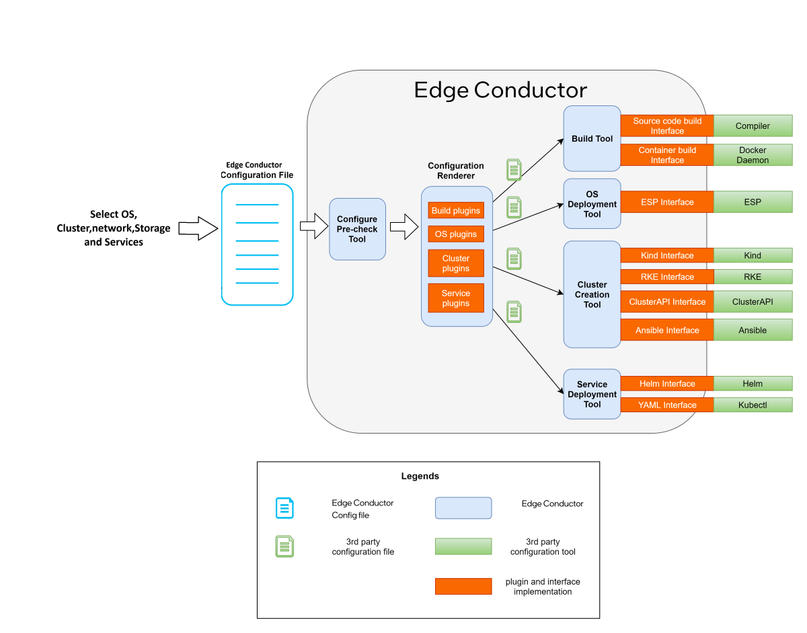
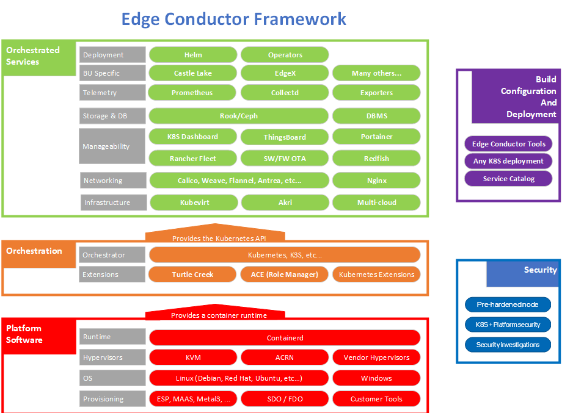

# Intel® Edge Conductor 
## Overview

Intel®  Edge Conductor provides complete end-to-end manageability and infrastructure orchestration for all edges across various IoT verticals such as retail, health care, manufacturing, Banking, and entertainment. 

Edge Conductor is designed and built from the ground up using modular microservices-based software stack focusing on heterogeneous needs of IoT verticals. The two main functional components are manageability and infrastructure orchestration. It also provides additional value-add such as policy engine, security, AI/ML capabilities, telemetry, automation and can interoperate with any Kubernetes* distribution.  

Edge Conductor offers tight integration of Intel platform capabilities with the ability to easily deploy and manage both the platforms (manageability) and the workloads (orchestration) based on customer and solution requirements. These capabilities are critical where data collection and data processing must take place at the edge often due to latency requirements, or cost and time of sending raw data to the cloud and waiting for the processed results to be delivered back to the edge where the activity takes place.  


Select [Configure & Download](https://www.intel.com/iot/edgesoftwarehub/download/home/edge_conductor) to download the software listed below.

[Configure & Download](https://www.intel.com/iot/edgesoftwarehub/download/home/edge_conductor)


-  **Time to Complete:** Approximately 90 minutes
-  **Programming Language:** Go*
-  **Available Software:** Intel® Edge Conductor and Edge Conductor Add-on


## HW Requirements for Edge Conductor Day-0 Host

The Day-0 host should meet the following minimum hardware requirements:

- CPU: 2 or more cores
- Memory: 2 gigabytes (GB) or greater.
- Storage: 10 GB or greater available storage is required to build and run the
  Day-0 environment.
- Internet connection: Internet connectivity is necessary to download and use
  some features.


Node Requirements:

- CPU: 2 or more cores
- Memory: 2 gigabytes (GB) or greater.
- Storage: 10 GB or greater available storage is required to build and run the
  Day-0 environment.
- Internet connection: Internet connectivity is necessary to download and use
  some features.


## OS and System Requirements for Edge Conductor Day-0 Host

- Ubuntu* 18.04+
- make 4.1+
- unzip 2.11+
- Docker* CE
    * 20.10.3+ (for Docker CE v20)
    * After you install Docker CE, configure a user group so you can use Docker
      without the `sudo` command.
      For details, follow [Post-installation steps for Linux](https://docs.docker.com/engine/install/linux-postinstall/).
- git 2.33.0+
- sudo
    * Passwordless sudo should be configured on every worker node. For details, follow [How to setup passwordless sudo](https://serverfault.com/questions/160581/how-to-setup-passwordless-sudo-on-linux)


Additional software:

*   Install [kubectl (v1.20.0)](https://kubernetes.io/docs/tasks/tools/) to
    interact with the clusters created with Edge Conductor. For details, follow
    the Kubernetes steps: [Install and Set Up kubectl on Linux](https://kubernetes.io/docs/tasks/tools/install-kubectl-linux/).


Proxy setup:

*   Be sure to set your proxies correctly. Some environments require network
    proxies for Docker operations (e.g. docker pull, docker push, docker run,
    and so on).
*   For http_proxy/HTTP_PROXY and https_proxy/HTTPS_PROXY, you must test they
    are actually working. Also note that the no_proxy/NO_PROXY list **MUST NOT
    contain spaces** between the addresses.

## How It Works



Figure 1: Architecture Diagram

Edge Conductor can be used to deploy Kubernetes* clusters in several different
ways. All of the deployment methods rely on a "Day-0" host machine, which is a
dedicated system that runs the Edge Conductor tools that download, build and
provision the required software. (*Day-0* is a lifecycle term used in network
automation and cloud deployment, where the high-level task on Day-0 is
installation, Day-1 is configuration, and Day-2 is optimization. Here it
indicates the host system used for installing the Edge Conductor tools.)


All Edge Conductor deployment methods also rely
on a management console to operate and administer the cluster.

  * Virtual cluster: All nodes in the cluster are virtualized as container
    images and Kubernetes is deployed on the user’s local machine. The Day-0
    host and management console are also the user's local machine. This
    deployment model is implemented using "kind" as described below.

  * On-premise cluster: All nodes in the cluster are actual physical (or
    virtual) machines.  The Day-0  and management console functions are
    performed on machine(s) outside the cluster.  This deployment model is
    implemented using either Rancher RKE or the Cluster API as described below.

  * Existing cluster: All nodes in the cluster have already been provisioned
    and are running Kubernetes, for example as in a StarlingX, VMWare Tanzu or
    OpenShift cluster or similar Kubernetes deployment. In this model only
    services are deployed and managed by the Edge Conductor tools. The Day-0 machine
    and management cluster are assumed to already exist.




Figure 2: Edge Conductor Framework

Edge Conductor is composed of 3 main layers:

*  Services Layer - This layer provides support different orchestrated services
   like Prometheus, Nginx, Redfish and Portainer.
*  Orchestration Layer - This layer provides Kubernetes API and extensions.
*  Platform Software Layer – This layer provides support for different
   hypervisors, Provisioning mechanism and OS support.


## Getting Started

### Install Edge Conductor

Select [Configure & Download](https://www.intel.com/iot/edgesoftwarehub/download/home/edge_conductor) to download the software package and then follow the steps below to download Edge Conductor source code.

[Configure & Download](https://www.intel.com/iot/edgesoftwarehub/download/home/edge_conductor)


1.  Make sure that the HW , OS and System requirements for Day-0 Host are met properly before proceeding further.
2.  If you are behind a proxy network, please ensure that proxy addresses are configured in the system:
  
	```shell
	export http_proxy=proxy-address:proxy-port
	export https_proxy=proxy-address:proxy-port
	```
   
3. Open a new terminal, go to the downloaded folder and unzip the downloaded Edge Conductor Package: 

	```shell
	unzip intel_edge_conductor.zip
	```
4. Go to the intel_edge_conductor directory:

	```shell
	cd intel_edge_conductor
	```

5. Change permission of the executable edgesoftware file:

	```shell
	chmod 755 edgesoftware 
	```
6. Run the command below to download Edge Conductor source code:

	```shell
	./edgesoftware install
	```

7. Once the command finishes successfully, goto the source code folder:

	```shell
	cd Intel_Edge_Conductor_0.4.0/CodeBase
	```
8. The folder structure of `CodeBase` is:   

	```shell
	CodeBase
	 |- edge-conductor
	 |- addon
	```
9. Go to the edge-conductor directory and build Edge Conductor code: 

	```shell
	cd edge-conductor
	make
	cd .. 
	```
	You will see output similar to:

	```shell
	make -C api/schemas
	make -C api/proto build
	go mod tidy
	go run build/plugingenerator.go
	go vet ./pkg/... ./cmd/...
	Going to format and build code.
	...
	go build -v -o _workspace/bin/conductor cmd/conductor/main.go
	...
	```

	If `make` is successful, no ERROR messages are displayed on the console. The `make` command, generates binary files under the `_workspace`. Folder and configuration files are also copied to `_workspace`.
    
10. Build Edge Conductor Addon and copy the build result to the Edge Conductor tool _workspace:

	```shell
	cd addon
	make
	cp -rf _workspace/ ../edge-conductor/_workspace/addon
	cp -rf _workspace/services/* ../edge-conductor/_workspace/services/
	cd ..
	```
11. Change to the workspace folder.:

    ```shell
    cd edge-conductor/_workspace
    ```

    The file structure generated under the `_workspace` folder is:

    ```bash
    _workspace/
     ├── addon
     ├── bin
     ├── config
     ├── experienceKit
     ├── services     
     ├── conductor -> bin/conductor
     ├── kubectl -> bin/kubectl
     └── workflow
    ```

Run ``./conductor help`` to see command line usage.


### Deploying a kind Cluster Using Edge Conductor

Kind is a tool for testing Kubernetes, it runs a local Kubernetes cluster using Docker itself. Follow these steps below to deploy a Kubernetes in Docker (kind) deployment with Edge Conductor tool.

**Prerequisites**
- Make sure that Edge Conductor code is built successfully and you can see the binary files generated under `_workspace` folder.
- Follow HW and System requirements to prepare the Day-0 host hardware and software.

> *NOTE:*  For each kind node, 2 CPU cores and 2 gigabytes (GB) memory are
> additionally needed.

**Experience Kit (EK) for Kind**

An example of Experience Kit for kind is under:

```shell
experienceKit/
└── DEK
    └── kind.yml
```

We will use [this Experience Kit](https://github.com/intel/edge-conductor/blob/edge_conductor_v0.4.0/experienceKit/DEK/kind.yml) to deploy the KIND cluster in this document.

**Custom Config**

Open the Experience Kit config file (experienceKit/DEK/kind.yml) and modify the password of the local registry. Edge Conductor tool will launch a local registry as the storage of binary files, container images and configuration files. This registry password will be used to create user authentication.


```yaml
Parameters:
  customconfig:
    registry:
      password: "<passWord_nnnn>"
```

> *Note:* The password must be surrounded by double quotes (`"`). We recommend that it contains at least 8 characters with 1 lowercase letter, 1 uppercase letter and 1 numeric character.
Check more details of the [Experience Kit configuration here](https://github.com/intel/edge-conductor/blob/edge_conductor_v0.4.0/docs/guides/ec-configurations.md).


**Init Edge Conductor Environment**

Run the following commands to initialize the Edge Conductor environment:

```bash
./conductor init -c experienceKit/DEK/kind.yml
```

You will see output similar to:

```shell
INFO[0000] Init Edge Conductor
INFO[0000] ==
INFO[0000] Current workflow: init
...
INFO[0005] workflow finished
INFO[0005] ==
INFO[0005] Done
```

**Build and Deploy a Kind Cluster**

Run the following command to build a kind Cluster:

```bash
./conductor cluster build
```

You will see output similar to:

```bash
INFO[0000] Init Edge Conductor
INFO[0000] ==
INFO[0000] Top Config File: experienceKit/DEK/kind.yml
...
INFO[0008] workflow finished
INFO[0008] Connecting Plugin docker-run
INFO[0008] ==
INFO[0008] Done
```

Run the following command to deploy the kind Cluster:

```bash
./conductor cluster deploy
```

You will see output similar to:

```bash
INFO[0000] Edge Conductor - Deploy Cluster
INFO[0000] ==
...
Creating cluster "kind" ...
 ✓ Ensuring node image (kindest/node:v1.21.1) 🖼
 ✓ Preparing nodes 📦 📦 📦 📦
 ✓ Writing configuration 📜
 ✓ Starting control-plane 🕹️
 ✓ Installing CNI 🔌
 ✓ Installing StorageClass 💾
 ✓ Joining worker nodes 🚜
Set kubectl context to "kind-kind"
...
INFO[0094] workflow finished
INFO[0094] ==
INFO[0094] Done
```

The kubeconfig will be copied to the default path `~/.kube/config`.

> *NOTE:*  If you export KUBECONFIG, you need to unset the KUBECONFIG or copy
`~/.kube/config` to your KUBECONFIG directory.

**Build and Deploy services on Kind Cluster**

To build sevices on kind cluster:

```bash
./conductor service build
```

You will see output similar to:

```bash
INFO[0000] Edge Conductor - Build Services
INFO[0000] ==
INFO[0000] Current workflow: service-build
...
INFO[0007] Downloading service resource files.
INFO[0008] Downloaded successfully.
...
INFO[0009] workflow finished
INFO[0009] ==
INFO[0009] Done
```

Deploy the services into kind cluster:

```bash
./conductor service deploy
```

You will see output similar to:

```bash
INFO[0000] Edge Conductor - Deploy Services
INFO[0000] ==
INFO[0000] Current workflow: service-deploy
...
INFO[0001] Yaml services will be deployed.
INFO[0002] Helm services will be deployed.
INFO[0003] Successfully installed releases...
...
INFO[0004] workflow finished
INFO[0004] ==
INFO[0004] Done
```
## Interact With Nodes

After the services are deployed, you can interact with the target cluster using
the kubeconfig exported by the Edge Conductor tool.

To learn more about kind clusters, refer to the
[Kind Quick Start guide](https://kind.sigs.k8s.io/docs/user/quick-start).

### Get Nodes

Check the nodes that are available with the command:

```
kubectl get nodes
```

You will see output similar to:

```
NAME                 STATUS   ROLES                  AGE     VERSION
kind-control-plane   Ready    control-plane,master   2m49s   v1.23.4
kind-worker          Ready    <none>                 68s     v1.23.4
```

### Get Services

Check the services deployed to the kind cluster with the command:

```bash
kubectl get pods,svc,nodes -A
```

You will see output similar to:

```shell
NAMESPACE            NAME                                             READY   STATUS    RESTARTS   AGE
kube-system          pod/coredns-558bd4d5db-4qjmq                     1/1     Running   0          11m
kube-system          pod/coredns-558bd4d5db-fckgb                     1/1     Running   0          11m
kube-system          pod/etcd-kind-control-plane                      1/1     Running   0          11m
kube-system          pod/kindnet-djzbj                                1/1     Running   0          11m
kube-system          pod/kindnet-l5x8b                                1/1     Running   0          11m
kube-system          pod/kube-apiserver-kind-control-plane            1/1     Running   0          11m
kube-system          pod/kube-controller-manager-kind-control-plane   1/1     Running   0          11m
kube-system          pod/kube-proxy-7vrf8                             1/1     Running   0          11m
kube-system          pod/kube-proxy-dvgw9                             1/1     Running   0          11m
kube-system          pod/kube-scheduler-kind-control-plane            1/1     Running   0          11m
local-path-storage   pod/local-path-provisioner-547f784dff-28jlh      1/1     Running   0          11m
NAMESPACE     NAME                 TYPE        CLUSTER-IP   EXTERNAL-IP   PORT(S)                  AGE
default       service/kubernetes   ClusterIP   10.96.0.1    <none>        443/TCP                  12m
kube-system   service/kube-dns     ClusterIP   10.96.0.10   <none>        53/UDP,53/TCP,9153/TCP   12m
NAMESPACE   NAME                      STATUS   ROLES                  AGE   VERSION
            node/kind-control-plane   Ready    control-plane,master   12m   v1.21.1
            node/kind-worker          Ready    <none>                 11m   v1.21.1
```

Make sure that the status for all pods is `Running`.


## Summary and Next Steps

Congratulations! You have deployed a kind cluster with Edge Conductor tool!.

As a next step, try to deploy some simple applications on the Kubernetes cluster you built with Edge Conductor.

-   [Example: Hello Cluster](https://github.com/intel/edge-conductor/blob/main/docs/tutorials/samples/hello-cluster.md)
-   [Example: Hello Cluster! Helm Version](https://github.com/intel/edge-conductor/blob/main/docs/tutorials/samples/hello-cluster-helm.md)
-   [Example: Web Indexing Sample Application](https://github.com/intel/edge-conductor/blob/main/docs/tutorials/samples/web-indexing.md)

If you need to remove the kind cluster, you can do it by

```bash
./conductor cluster remove
```
> *NOTE:*  To stop Edge Conductor services use `./conductor deinit`. Using the  `--purge` option will delete Edge Conductor configuration files and the certification and keys generated by the Edge Conductor tool. 
```bash
./conductor deinit --purge
```

## Learn More

To continue your learning, see the following guides and software resources:

-   [How to Deploy RKE cluster using Edge Conductor](https://github.com/intel/edge-conductor/blob/main/docs/guides/cluster-deploy-RKE.md)
-   [How to Deploy a cluster using Cluster API](https://github.com/intel/edge-conductor/blob/main/docs/guides/cluster-deploy-ClusterAPI.md)

`docs/guides` folder in Edge conductor addon package contains resources for enabling additional addon features like

-	Tanzu cluster build, reconcile and node join in offline mode.
-	FDO services build and deployment.
-	Redfish services build and deployment.

## Troubleshooting

* Verify that the pods are Ready as well as in Running state using below command: .

  ```bash
  kubectl get pods -A
  ```
* If any pods are not in Running state, use the following command to get more information about the pod state: 

  ```bash
  kubectl describe -n default pod <pod_name>
  ```
* Make sure to add your machine IP to `NO_PROXY` while setting your proxy environment ,otherwise `./conductor init` , `./conductor cluster build` operation may fail.  

* To delete Edge Conductor configuration files and the certification and keys generated by the Edge Conductor tool, use:

  ```bash
  ./conductor deinit --purge
  ```

## Support Forum
If you're unable to resolve your issues, contact the [Support Forum](https://software.intel.com/en-us/forums/intel-edge-software-recipes).
