# Edge Video Analytics Microservice (EVAM) on Intel® Smart Edge Open Developer Experience Kit

## Overview

Perform video processing, inference, and analytics operations using Edge Video
Analytics Microservice (EVAM) on Intel® Smart Edge Open Developer Experience
Kit. Use the video analytics algorithms to perform object detection,
classification, identification, counting, and tracking on the input video
stream. Set up your own deep learning models and create
pipelines. An application can use these deep learning models by configuring
video analytics pipelines as per requirement. EVAM can be used in a wide range of
business domains such as video surveillance, healthcare, retail, entertainment
and industrial.

To run the reference implementation, you will need to first download and install
the [Intel® Smart Edge Open Developer Experience
Kit](https://software.intel.com/iot/edgesoftwarehub/download/home/Smart_Edge_Open_Developer_Experience_Kits).

Once you have installed the Intel® Smart Edge Open Developer Experience Kit,
select [Configure &
Download](https://recipeconfigurator-quiet-toucan.apps1-bg-int.icloud.intel.com/iot/edgesoftwarehub/download/home/ri/edge_video_analytics_microservice_on_developer_experience_kit)
to download the Edge video analytics microservice and the software listed below.


-  **Time to Complete:** Approximately 60 - 90 minutes
-  **Programming Language:** Python*
-  **Software:**

    -  Intel® Smart Edge Open version 22.03 or above
    -  Edge Video Analytics Microservice
    -  Intel® DL Streamer Pipeline Server
    -  Intel® Distribution of OpenVINO™ toolkit


## Target System Requirements

### Intel® Smart Edge Open Nodes

-  One of the following processors:
    - Intel® Xeon® Scalable processor
    - Intel® Xeon® D processor

-  At least 32 GB RAM
-  At least 64 GB hard drive
-  An Internet connection
-  Ubuntu* 20.04 LTS

## How It Works

### Edge Video Analytics Microservice (EVAM) Architecture

Video Analytics basically refers to transforming video streams into insights
through video processing, inference, and analytics operations.

These operations featured by Video Analytics are packaged in Edge Video
Analytics Microservice (EVAM) on Intel® Smart Edge Open Developer Experience
Kit. Edge Video Analytics Microservice on Intel® Smart Edge Open Developer
Experience Kit is deployed as a single POD and it comes up with optimized video
analytics pipelines. The pipelines run by the microservice are defined in
GStreamer* using [Intel® DL
Streamer](http://github.com/opencv/gst-video-analytics) for inferencing. This
microservice uses [Intel® DL Streamer Pipeline
Server](http://github.com/intel/video-analytics-serving) as a library.

Edge Video Analytics Microservice on Intel® Smart Edge Open Developer Experience
Kit provides the RESTful APIs  to discover, start, stop, customize, and monitor
pipeline execution and supports MQTT and Kafka message brokers for publishing
the inference results. For REST API definition, refer to the [RESTful
Microservice
interface](https://github.com/intel/video-analytics-serving/blob/master/docs/restful_microservice_interfaces.md).

The Intel® Smart Edge Open Developer Experience Kit platform infrastructure is
used to deploy this Microservice. When Edge Video Analytics Microservice is
deployed default pipelines and their respective models object detection, object
classification, object tracking, face detection, emotion recognition, action
recognition and ambient audio detection are already provided with it. Purpose of
Edge Video Analytics Microservice on Intel® Smart Edge Open Developer Experience
Kit is to showcase that Users can use this Microservice in backend for their
applications or Users can develop new pipeline according to their requirement.

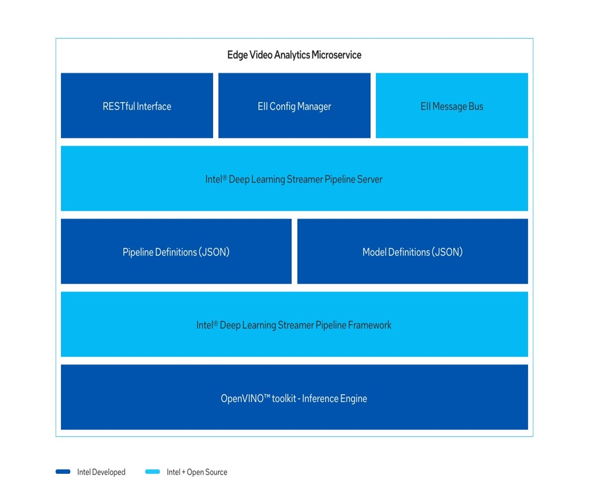

Figure 1: Architecture Diagram

>NOTE: The microservice natively provides two modes of operation: Edge Video
>Analytics (EVA) Mode and Edge Insights for Industrial (EII) Mode. Here we are
>deploying the microservice in Edge Video Analytics (EVA) Mode only.

## Get Started

These instructions walk you through installing and uninstalling an example Edge
Video Analytics Microservice reference application using commands. After
installation, you will be able to see the application is running on the cluster.
The uninstall commands can be used to uninstall the application.

### Installation Prerequisites

To run the reference implementation, you need to first download and install
the [Intel® Smart Edge Open Developer Experience
Kit](https://software.intel.com/iot/edgesoftwarehub/download/home/Smart_Edge_Open_Developer_Experience_Kits).

Ensure that the following conditions are met properly to ensure a smooth
installation process for a Edge Video Analytics Microservice done through Intel®
Smart Edge Open Developer Experience Kit package.

#### Hardware Requirements

We recommend that your system satisfies the specifications listed in the
[Target System Requirements](#target-system-requirements) section of this
document. Also, be sure that you have a fresh installation of the Intel® Smart
Edge Open Developer Experience Kit.

#### Ensure that following steps are completed in Intel® Smart Edge Open Developer Experience Kit Installation

1. Proxy Settings

   If you are behind a proxy network, ensure that proxy addresses are configured
   in the system.

      ```shell
      export http_proxy=<proxy-address>:<proxy-port>
      export https_proxy=<proxy-address>:<proxy-port>
      ```

2. Ensure the ``/etc/wgetrc`` file is configured with required proxy settings as
   follows:

      ```bash
      https_proxy=<proxy-address>:<proxy-port>
      http_proxy=<proxy-address>:<proxy-port>
      ftp_proxy =<proxy-address>:<proxy-port>
      use_proxy = on
      ```

3. Date and Time

   Make sure that the date and time are in sync with current local time.

4. Create Non-Root User

   Make sure that non-root user with name and password ``smartedge-open`` and with
   sudoers permission is created. If not available, follow the instructions
   below.

   i. To create a user smartedge-open execute the command:

      ```bash
      useradd -s /bin/bash -d /home/smartedge-open/ -m -G sudo smartedge-open
      passwd smartedge-open
      ```

   ii. A password for the given user is required:

      ```shell
      passwd smartedge-open
      ```

   iii. As some tasks require root privileges, the non-root user needs to have a
        possibility to become a root:

      ```shell
      echo “smartedge-open ALL=(ALL) NOPASSWD:ALL” | sudo tee /etc/sudoers.d/smartedge-open
      ```

5. Exchange SSH Keys between hosts

   Exchanging SSH keys between hosts permits a password-less SSH connection from the host running Ansible to the hosts being set up. If password-less SSH is not permitted, follow the instructions below to exchange SSH keys between hosts. Generate and install the public key on your host by logging in as root and executing the below commands:

   In the first command, the Edge Controller host must have a generated SSH key. The SSH key can be generated by executing ssh-keygen and obtaining the key from the output of the command.

   In the second command, the generated key must be copied to every Edge Node host, using the ssh-copy-id command.

      ```bash
      ssh-keygen
      ssh-copy-id smartedge-open@<host-name>
      ```

### Install the Edge Video Analytics Microservice on Intel® Smart Edge Open Developer Experience Kit

Select [Configure & Download](https://recipeconfigurator-quiet-toucan.apps1-bg-int.icloud.intel.com/iot/edgesoftwarehub/download/home/ri/edge_video_analytics_microservice_on_developer_experience_kit) to download the reference implementation and then follow the steps below to install it.

1. Make sure that the [Target System Requirements](#target-system-requirements)
   are met properly before proceeding further.

    - For single-device mode, only one machine is needed. (Both controller and edge node will be on the same device.)

    - For multi-device mode, make sure you have at least two machines (one for controller and other for Edge Node).

        >NOTE: Multi-device mode is not supported in the current release.

2. Open a new terminal and login to server as a non-root user.

    ```shell
    ssh smartedge-open@<server-ip-address>
    ```

3. Confirm that the server is configured with Intel® Smart Edge Open Developer Experience Kit as prerequisite.

4. Move the downloaded zip package to ``/home/smartedge-open`` folder.

    ```shell
    mv <path-of-downloaded-directory>/edge_video_analytics_microservice_on_developer_experience_kit.zip /home/smartedge-open
    ```

5. Go to the ``/root`` directory of the non-root user using the following command and unzip the RI package:

    ```shell
    cd /home/smartedge-open
    unzip edge_video_analytics_microservice_on_developer_experience_kit.zip
    ```

6. Go to ``edge_video_analytics_microservice_on_developer_experience_kit/`` directory:

    ```shell
    cd edge_video_analytics_microservice_on_developer_experience_kit
    ```

7. Change permission of the executable edgesoftware file:

    ```shell
    chmod 755 edgesoftware
    ```

8. Run the command below to install the Reference Implementation:

    ```shell
    ./edgesoftware install
    ```

9. Installation of the package starts.

    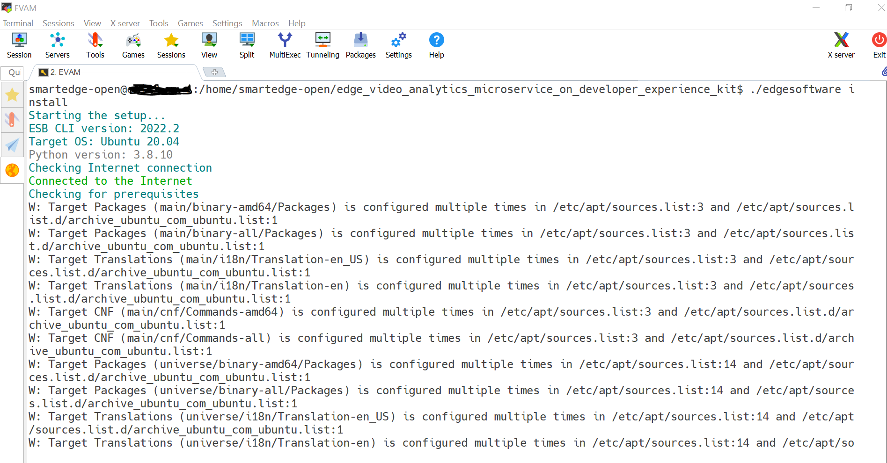

    Figure 2: Installation Start Screen

10. For internal installation, the Helm charts are pushed to Intel Harbor
    Registry. To pull charts, provide your Harbor Username and password during
    the installation process. When the installation is complete, you see the
    message ``Installation of package complete`` and the installation status for
    each module.

    > NOTE: Installation logs are available at: ``/var/log/esb-cli/Edge_Video_Analytics_Microservice_on_Developer_Experience_kit_<version>/Edge_Video_Analytics_Microservice_on_Developer_Experience_kit/install.log``, where ``<version>`` is the package version downloaded.

    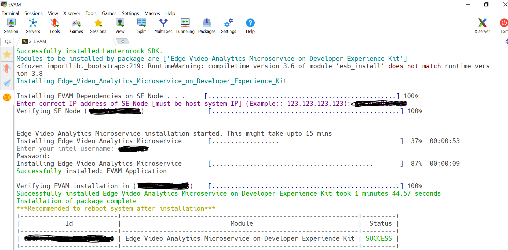

   Figure 3: Installation Successful

11. If Intel® Smart Edge Open Developer Experience Kit is installed, running the
    following command should show output similar to the image below. All the
    pods should be either in the running or completed stage.

    ```shell
    kubectl get pods -A
    ```

    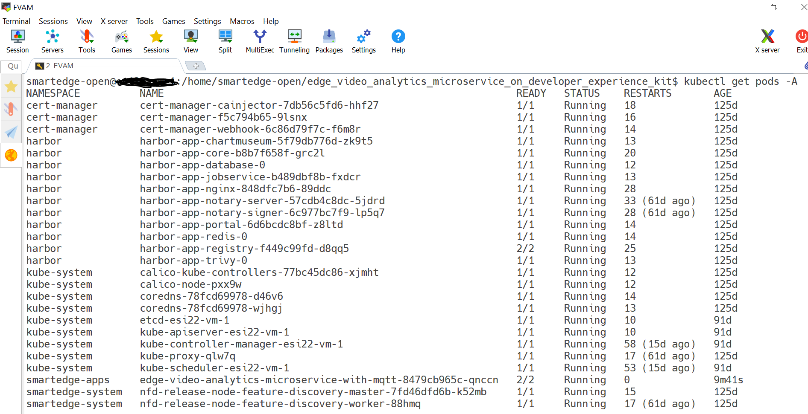

    Figure 4: Pods Status

12. If EVAM is installed, running the following command should show output as follows:

    ```shell
    smartedge-open@host:/home/smartedge-open/edge_video_analytics_microservice_on_developer_experience_kit$ kubectl get pods -n smartedge-apps

    NAME                                                           READY   STATUS    RESTARTS   AGE
    edge-video-analytics-microservice-with-mqtt-8479cb965c-vwq7n   2/2     Running   0          12m
    ```

    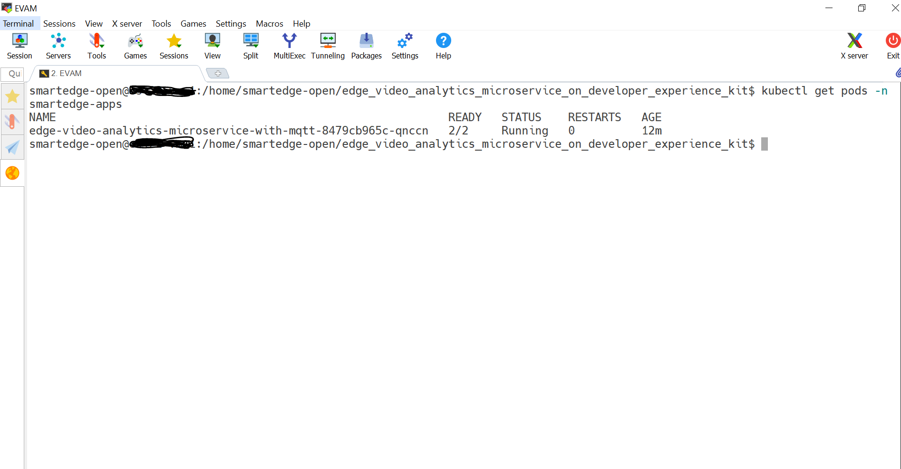

   Figure 5: EVAM Pod Status

13. Run the command below to check the Docker* images and their details.

    ```shell
    smartedge-open@host:/home/smartedge-open/edge_video_analytics_microservice_on_developer_experience_kit$ docker images

    intel/edge_video_analytics_microservice      0.7.2         8919ec246253   8 weeks ago     2.89GB
    eclipse-mosquitto                            1.6           af43c2bdc1a9   4 months ago    11.5MB
    ```

14. List the reference implementation deployed module using the following command:

    ```shell
    ./edgesoftware list
    ```

    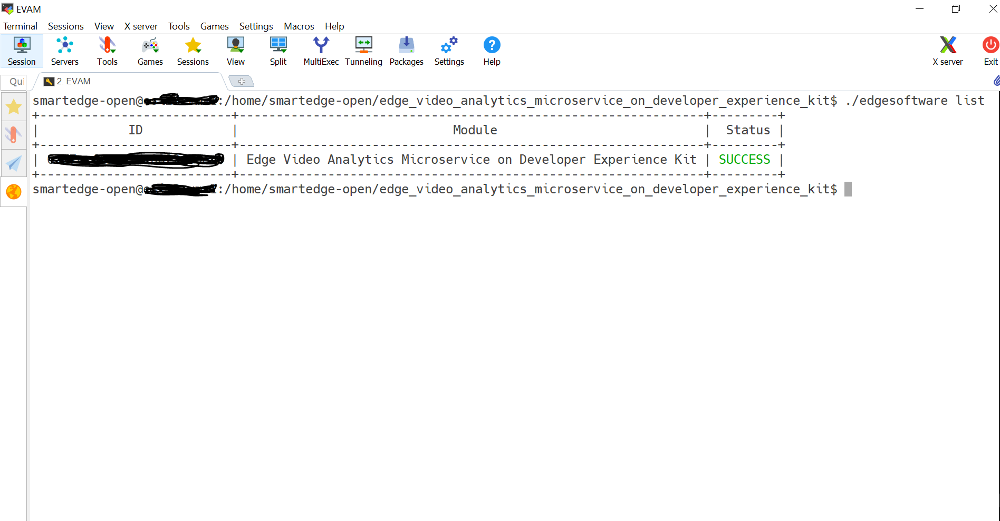

    Figure 6: EVAM Module List

15. Uninstall the reference implementation module using the following command:

    ```shell
    ./edgesoftware uninstall <evam-module-id>
    ```

    

    Figure 7: Uninstallation Successful

### Node Feature Discovery (NFD)

Edge Video Analytics Microservice (EVAM) uses the Intel® Distribution of
OpenVINO™ toolkit, which is optimized for Intel® processors that support special
instructions like AVX512VNNI for optimized performance. The deployment of this
application will require the node with this feature supported on the node along
with Ubuntu 20.04 OS. This NFD feature ensures to deploy the application on the
node supported with these features.

NFD is installed by Intel® Smart Edge Open Developer Experience Kit and running
as two pods on Intel® Smart Edge Open, as shown below.

```bash
$ kubectl get pods -A | grep smartedge-system

smartedge-system       nfd-release-node-feature-discovery-master-7b94765ccf-9ghjg   1/1     Running   5 (83d ago)    85d
smartedge-system       nfd-release-node-feature-discovery-worker-dq4x6              1/1     Running   5 (83d ago)    85d
```

Edge Video Analytics Microservice (EVAM) pod scheduled and running successfully
on Intel® Smart Edge Open node based on hardware capabilities of Intel® Xeon®
Scalable server.

```bash
$ kubectl get pods -A | grep smartedge-apps

smartedge-apps       edge-video-analytics-microservice-with-mqtt-8479cb965c-vwq7n                   2/2     Running   0              54m
```

The following output shows a description of one EVAM pod, which shows that it is
running successfully with the NFD feature.

```bash
$ kubectl describe pod edge-video-analytics-microservice-with-mqtt-8479cb965c-vwq7n -n smartedge-apps
...
...
...

Node-Selectors:           feature.node.kubernetes.io/cpu-cpuid.AVX512VNNI=true
   feature.node.kubernetes.io/system-os_release.ID=ubuntu
       Tolerations:                 node.kubernetes.io/not-ready:NoExecute op=Exists for 300s
  node.kubernetes.io/unreachable:NoExecute op=Exists for 300s
       Events:
```

### Run Application with EVAM

To run an application using EVAM its respective deep learning models and pipelines are required.

EVAM provides the RESTful APIs as Video Analytics Serving to discover, start, stop, customize, monitor pipeline execution.

EVAM also include MQTT and Kafka message brokers for publishing the inference results.
REST API definitions are available at RESTful Microservice interface.

#### Get the List of Available Models and Pipelines Using REST Request

1. Run the following command to get the list of models available in the EVAM:

   ```shell
   curl --location -X GET 'http://<Node-IP-address>:30409/models'
   ```

   Example Output:

   ```shell
   [
   {
      "description": "object_classification",
      "name": "object_classification",
      "networks": {
         "labels": null,
         "model-proc": "/home/pipeline-server/models/object_classification/vehicle_attributes/vehicle-attributes-recognition-barrier-0039.json",
         "networks": {
               "FP16": "/home/pipeline-server/models/object_classification/vehicle_attributes/FP16/vehicle-attributes-recognition-barrier-0039.xml",
               "FP32": "/home/pipeline-server/models/object_classification/vehicle_attributes/FP32/vehicle-attributes-recognition-barrier-0039.xml"
         }
      },
      "type": "IntelDLDT",
      "version": "vehicle_attributes"
   }
   ]
   ```

2. Run the following command to get the list of pipelines available in the
   microservice:

   ```shell
   curl --location -X GET 'http://<Node-IP-address:30409/pipelines'
   ```

   Example Output:

   ```shell
   [
   {
      "description": "Person Vehicle Bike Detection based on person-vehicle-bike-detection-crossroad-0078",
      "name": "object_detection",
      "parameters": {
         "properties": {
               "detection-device": {
               "element": {
                  "name": "detection",
                  "property": "device"
                  },
                  "type": "string"
               },
               "detection-model-instance-id": {
                  "element": {
                  "name": "detection",
                  "property": "model-instance-id"
                  },
                  "type": "string"
               },
               "inference-interval": {
                  "element": "detection",
                  "type": "integer"
               },
               "threshold": {
                  "element": "detection",
                  "type": "number"
               }
         },
         "type": "object"
      },
      "type": "GStreamer",
      "version": "person_vehicle_bike"
   },
   {
      "description": "Decode Pipeline",
      "name": "video_decode",
      "type": "GStreamer",
      "version": "app_dst"
   }
   ]
   ```

#### Create Pipeline by Sending REST Request

The following references provide the example json syntax pipeline creation using RESTful APIs.

```shell
curl --location -X POST '<http://localhost:30409/pipelines/<pipeline_name>/<model_name>>' \
--header 'Content-Type: application/json' \
--data-raw '{
  "source": {
      "uri": "<the uri of video source that needs to be analyzed>",
      "type": "uri"
   },
  "destination": {
      "metadata": {
        "type": "mqtt",
        "host": "localhost:1883",
        "topic": "vaserving"
      },
    "frame": {
      "type": "rtsp",
      "path": "vasserving1"
    }
  }
}'
```

To run the Object (Person, Vehicle, Bike) Detection use case with EVAM on Intel®
Smart Edge Open Developer Experience Kit, a sample pipeline request is created
for reference. A ``pipeline_create.sh`` script is created under sample_requests
directory, go to sample_requests directory and execute it using
``./pipeline_create.sh``.

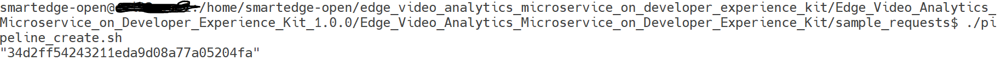

Figure 8: Run Pipeline Script

#### Check Pipeline Status

After execution of REST request it will return a pipeline instance ID, which can
be used to query the state of the pipeline.

The state of pipeline can be checked using following command:

```shell
curl --location -X GET 'http://<Node-IP-address>:30409/pipelines/<Pipeline_name>/<Model_name>/<Instance_ID>/status'
```

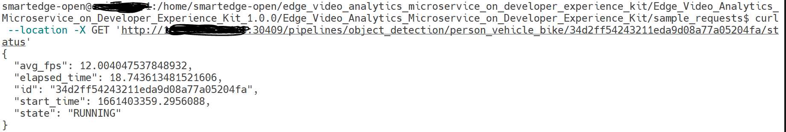

Figure 9: Pipeline Status

> NOTE: The pipeline should be in the "RUNNING" state to view the output video. If the pipeline has already ended, then the state will be shown as "COMPLETED". Start it again with the curl command and then view the video output.

#### Visualize Output

The output can be verified through the rtsp stream being published by the Gstreamer pipeline for the specific topic.

The Output can be verified with GUI and the VLC media player can be used for live streaming of the processed Video.

To visualize the output after the pipeline is started using the curl/Json command.

```Start "VLC Media player" → Select "Media" → Select "Open Network Stream" → Enter the URL details in "Network Protocol" as shown below rtsp://<Node IP>:30410/vasserving1 and click on play to run.```

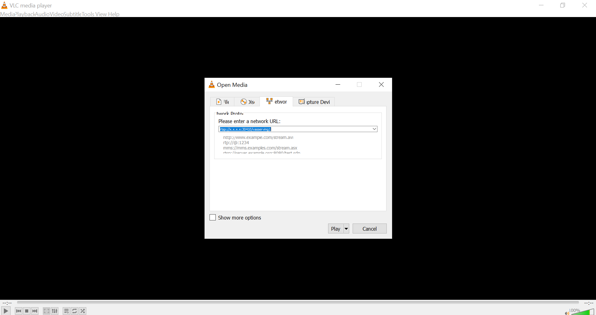

Figure 10: RTSP Stream in VLC player

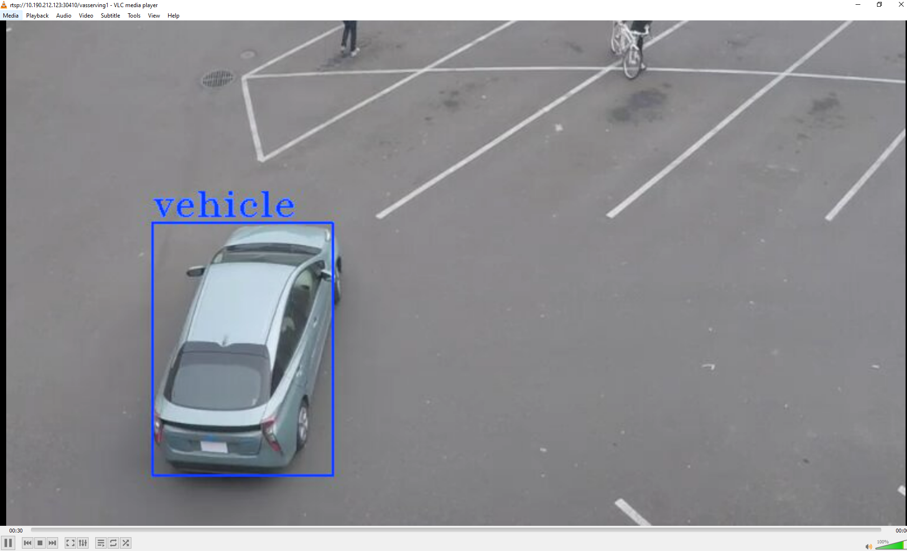

Figure 11: Streaming Output Visualization

### Run Multiple Simultaneous Use Cases with EVAM

Multiple simultaneous pipelines can also created by invoking similar RESTful
APIs as described above. When output frame passes through mqtt-broker, it is
available for visualization at a mentioned path in "frame" section. While
invoking multiple pipelines in parallel make sure each pipeline request has
different path for visualization.

#### Create Pipeline 1: Object Detection Use Case

```shell
curl --location -X POST '<http://localhost:30409/pipelines/<Pipeline_name_1>/<Model_name_1>>' \
--header 'Content-Type: application/json' \
--data-raw '{
  "source": {
      "uri": "<the uri of video source that needs to be analyzed>",
      "type": "uri"
   },
  "destination": {
      "metadata": {
        "type": "mqtt",
        "host": "localhost:1883",
        "topic": "vaserving"
      },
    "frame": {
      "type": "rtsp",
      "path": "vasserving1"
    }
  }
}'
```

#### Create Pipeline 2: Object Classification Use Case

```shell
curl --location -X POST '<http://localhost:30409/pipelines/<Pipeline_name_2>/<Model_name_2>>' \
--header 'Content-Type: application/json' \
--data-raw '{
  "source": {
      "uri": "<the uri of video source that needs to be analyzed>",
      "type": "uri"
   },
  "destination": {
      "metadata": {
        "type": "mqtt",
        "host": "localhost:1883",
        "topic": "vaserving"
      },
    "frame": {
      "type": "rtsp",
      "path": "vasserving2"
    }
  }
}'
```

Here two different pipelines are created simultaneously. Let, say one is
object_detection/person_vehicle_bike and other is
object_classification/vehicle_attributes. Both pipelines use different video
file sources as per their use cases.

>NOTE: Both pipelines have different paths in the "frame" section for
>visualization. One pipeline uses ``vasserving1`` path and the other pipeline
>uses ``vasserving2`` path.

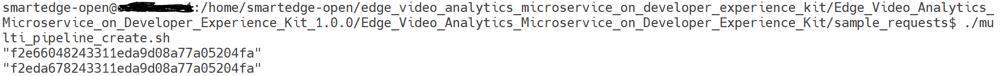

Figure 12: Run Multiple Pipelines Simultaneously

If there are two parallel pipelines created with their path in ``"frame"``
section are ``vasserving1`` and ``vasserving2`` respectively, their output
streaming URLs will be:

```shell
rtsp://<Node-IP-address>:30410/vasserving1
rtsp://<Node-IP-address>:30410/vasserving2
```

### Summary and Next Steps

Edge Video Analytics Microservice (EVAM), when deployed on Intel® Smart Edge
Open Developer Experience Kit created an impactful edge computing use-case that
provides an ability to user to perform video processing, inference, and
analytics operations by utilizing the capabilities of Intel® Smart Edge Open
Developer Experience Kit.


### Learn More

To continue learning, see the following guides:

-  Intel® Smart Edge Open Developer Experience Kit Architecture [https://smart-edge-open.github.io/ido-specs/doc/architecture/]
-  Edge Video Analytics Microservice [https://www.intel.com/content/www/us/en/developer/articles/technical/video-analytics-service.html]
-  Customizing Video Analytics Pipeline Requests [https://github.com/dlstreamer/pipeline-server/blob/main/docs/customizing_pipeline_requests.md]
-  Defining Media Analytics Pipelines [https://github.com/dlstreamer/pipeline-server/blob/main/docs/defining_pipelines.md]


### Troubleshooting

<!-- In this section, provide troubleshooting information for any likely issues and a link to support.-->

If any issue is faced during installation, ensure that installation
prerequisites are configured properly.

#### Pods Status Check

Verify that the pods are Ready as well as in Running state using the following
command:

```shell
kubectl get pods -A
```

#### Pods are in “ImagePullBackOff” state for a long time

Describe the pods using the command:

```shell
kubectl describe pod -n smartedge-apps <pod name>
```

Fetch the image name with the tag and do a manual docker pull using the below
commands:

```shell
docker login
docker pull <image-name:tag>
```

#### Pod status shows “ContainerCreating” for a long time

If Pod status shows **ContainerCreating** or **Error** or **CrashLoopBackOff**
for 5 minutes or more, run uninstall command and install it again.

```shell
./edgesoftware uninstall -a
./edgesoftware install
```

#### Pod Status shows "pending" for a long time

If EVAM pod status is pending for 5 minutes or more, run the following command:

```shell
kubectl describe pods -n smartedge-apps
```
In EVAM pod, if you see the following event due to FailedScheduling, it may be
possible that AVX-512VNNI instruction set is not available in system CPU as
mentioned in the [Node Feature Discovery](#node-feature-discovery-nfd) section.

```shell
Events:
Type Reason Age From Message
---- ------ ---- ---- -------
Warning FailedScheduling 43s (x9 over 7m58s) default-scheduler 0/1 nodes are available: 1 node(s) didn't match Pod's node affinity/selector.
```


#### Uninstallation Failure

If uninstall command (./edgesoftware uninstall < module id >) fails, manually
uninstall EVAM deployment, which are specific to EVAM pod.

```shell
helm -n smartedge-apps uninstall evam
sudo rm -rf /var/lib/smartedge/evam/
```

#### Installation and Debug Log Info File Path

Installation log info of Intel® Smart Edge Open Developer Experience Kit will be available at:

```shell
/var/log/esb-cli/Smart_Edge_Open_Developer_Experience_Kits_<version>/Smart_Edge_Open_Developer_Experience_Kits/install.log
```

Installation log info of Edge Video Analytics Microservice on Intel® Smart Edge Open Developer Experience kit module will be available at:

```shell
/var/log/esb-cli/Edge_Video_Analytics_Microservice_on_Developer_Experience_kit_<version>/Edge_Video_Analytics_Microservice_on_Developer_Experience_kit/install.log
```

Where ``<version>`` is the package version downloaded.

### Support Forum

If you're unable to resolve your issues, contact the [Support Forum](https://software.intel.com/en-us/forums/intel-edge-software-recipes).

Execute the command below to consolidate a list of the log files in tar.gz compressed format, e.g., ``Edge_Video_Analytics_Microservice_on_Developer_Experience_kit.tar.gz``

```shell
tar -czvf Edge_Video_Analytics_Microservice_on_Developer_Experience_kit.tar.gz
/var/log/esb-cli/Edge_Video_Analytics_Microservice_on_Developer_Experience_kit_1.0.0/Edge_Video_Analytics_Microservice_on_Developer_Experience_kit/
/var/log/esb-cli/Smart_Edge_Open_Developer_Experience_Kits_3.0.0/Smart_Edge_Open_Developer_Experience_Kits/
```
