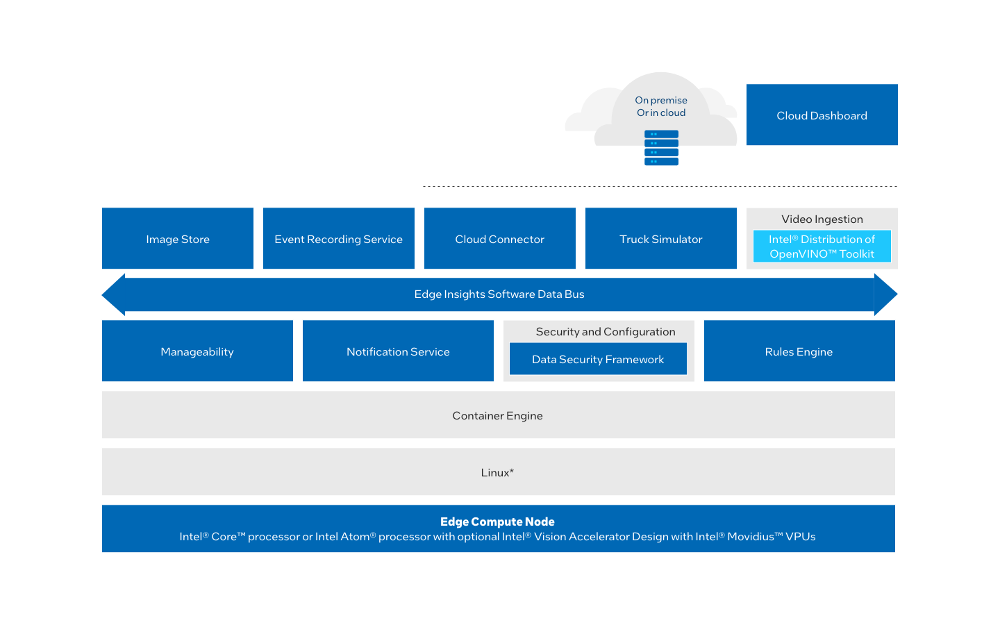

.. _how-it-works:

How it Works
============

Edge Insights for Fleet is a set of pre-integrated ingredients designed
to accelerate the development and deployment of solutions for the
industrial sector. The package is meant to be deployed on the device
closest to the data generation, such as the tool or machine assembling a
product. This enables the ingestion of video and time-series data,
storage of data, performing analytics, closing the loop by transmitting
a control message, and publishing the results.

This section provides an overview of the modules and services featured
with Edge Insights for Fleet.

Modules and Services
--------------------

Video Ingestion and Analytics
-----------------------------

**Video Analytics**

Classifier algorithms are executed in the Video Analytics container. The
container uses the Edge Insights Software Data Bus to subscribe to the
input stream published by the Video Ingestion container. The algorithms
included in the container are optimized for Intel hardware using the
Intel® Distribution of OpenVINO™ toolkit (OpenVINO™ and the
Intel\ :sup:`®` Math Kernel Library. You can create multiple instances
of the Video Analytics container to classify multiple video input
sources.

-  The `Intel® Distribution of OpenVINO™
   toolkit <https://software.intel.com/en-us/openvino-toolkit>`__ is a
   software development kit (SDK) for deploying deep learning computer
   vision inference applications. It optimizes inferencing on your edge
   IoT device for Intel\ :sup:`®` architecture.
-  The `Intel® Math Kernel
   Library <https://software.intel.com/en-us/mkl>`__ is a library of
   highly-optimized, threaded, and vectorized math routines designed to
   maximize performance on Intel\ :sup:`®` processors.

**Video Ingestion**

Edge Insights for Fleet supports ingestion from:

-  Video files.
-  GigE cameras.
-  USB cameras.
-  RTSP cameras.

Edge Insights for Fleet uses
`GStreamer\* <https://gstreamer.freedesktop.org/>`__ and OpenCV to
provide a preconfigured ingestion pipeline that you can modify for
different camera types and preprocessing algorithms. The Video Ingestion
container publishes video data, consisting of metadata and frames, to
the Edge Insights Software Data Bus. You can create multiple instances
of the Video Ingestion container to ingest video from multiple input
sources. In addition, the Video Ingestion container itself can run UDFs
performing analytics. This is recommended for faster processing of
frames to avoid transmission delays.

**Training and Learning Suite (TLS)**

The Training and Learning Suite has a web-based user interface for
training deep learning models. The key TLS features are:

-  Remote deployment of a TLS-trained model into an Edge Insights for
   Fleet system.
-  Visualization of Edge Insights for Fleet video data classification
   results.

**Image Store**

The image store provides storage and retrieval of images as binary
blobs. You can store the images persistently by using
`SQLite\* <https://www.sqlite.org/index.html>`__, an open source, SQL
database engine.

Security and Configuration
--------------------------

The Data Security Framework enables security through a two-stage process
involving provisioning and execution on an Edge Compute Node. Its
primary objective is to prevent unauthorized access of generated data
from within the system or via external network interfaces.

Edge Insights for Fleet uses `etcd\* <https://etcd.io/>`__ for
configuration management. etcd\* is a consistent, distributed key-value
store that provides a reliable way to store data that needs to be
accessed by a distributed system or cluster of machines.

Docker
------

`Docker\* <https://docker.com/>`__ is a container framework widely used
in enterprise environments. It allows applications and their
dependencies to be packaged together and run as a self-contained unit.

Edge Insights Software Data Bus
-------------------------------

The Edge Insights Software Data Bus is an abstraction over ZeroMQ*,
which is used for all inter-container communication.

`ZeroMQ\* <https://zeromq.org/>`__ is a brokerless message bus that
transfers data from the source directly to the destination. ZeroMQ\* is
used in TCP and IPC mode with pub-sub and request-response patterns.

