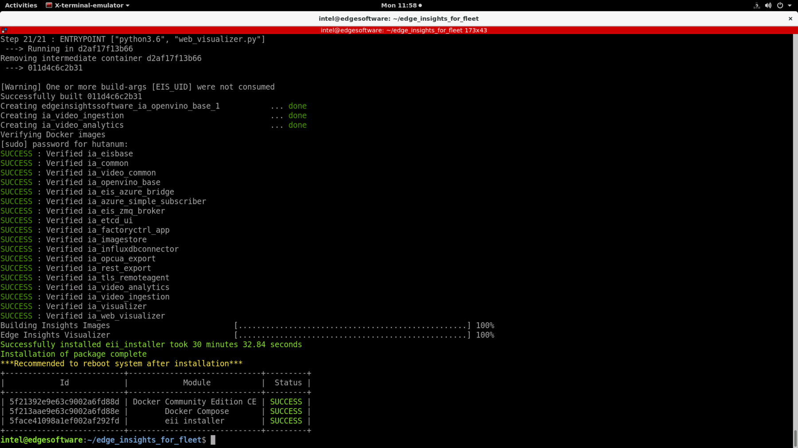
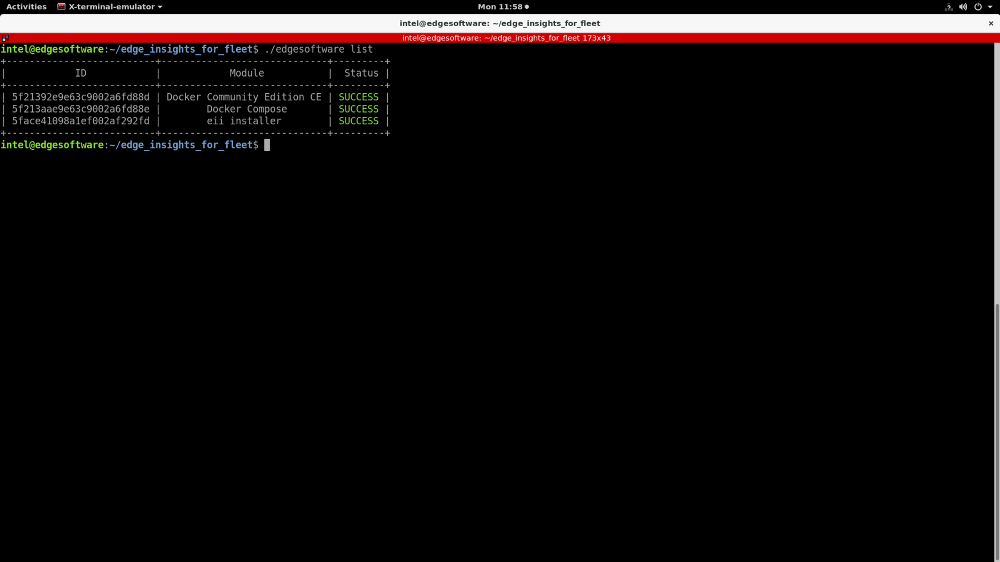
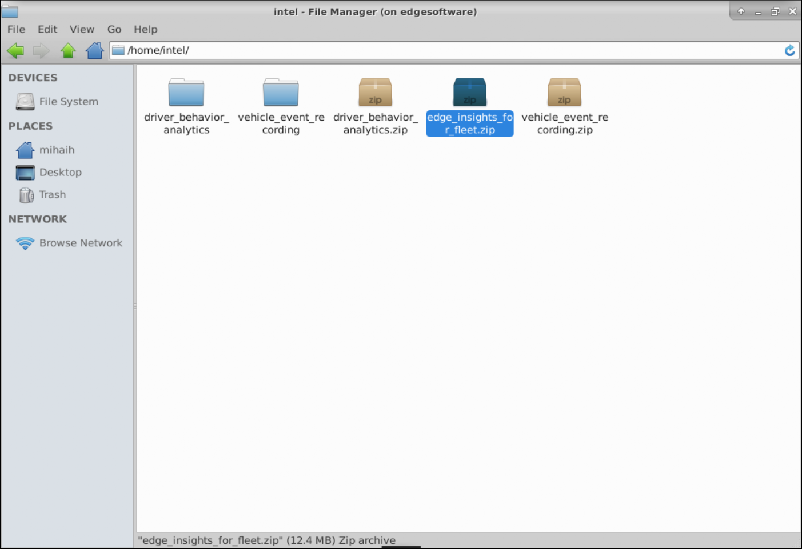
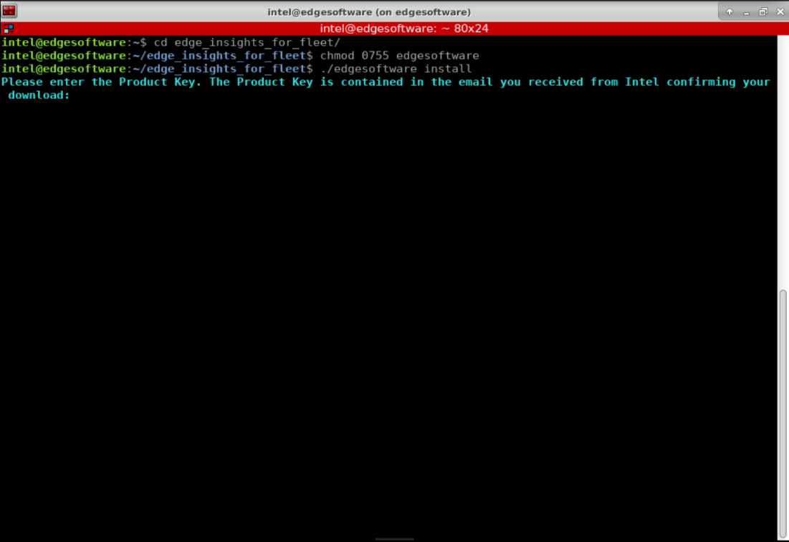

.. _install-edge-insights-for-fleet:

Install Edge Insights for Fleet
===============================

During the installation, you will be prompted to enter your product key.
This key is in the email you received from the Intel\ :sup:`®`
Registration Center. Contact `Support
Forum <https://software.intel.com/en-us/forums/intel-edge-software-recipes>`__
if you do not have this email message.

The steps below explain how to:

-  Prepare your target system.
-  Copy the package.
-  Complete the installation steps.

.. note::

   Be aware that screenshots may show a package version number that is
   different from the current release. See the :ref:`release-notes` for
   information on the current release.

Step 1: Prepare the Target System
---------------------------------

Make sure your target system has a fresh installation of Ubuntu\*
Linux\* that corresponds to the version of Edge Insights for Fleet that
you downloaded. If you need help installing Ubuntu*, follow these steps:

#. Download `Ubuntu package <http://releases.ubuntu.com/>`__ to your
   developer workstation.

#. Create a bootable flash drive using an imaging application, such as
   Startup Disk Creator, available on Ubuntu*.

#. After flashing the USB drive, power off your target system, insert
   the USB drive, and power on the target system.

   If the target system doesn't boot from the USB drive, change the boot
   priority in the system BIOS.

#. Follow the prompts to install Ubuntu\* with the default
   configurations. For detailed instructions, see the `Ubuntu
   guide <https://ubuntu.com/tutorials/install-ubuntu-desktop#1-overview>`__.

#. Power down your target system and remove the USB drive.

#. Power up the target system. You will see Ubuntu\* Desktop is
   successfully installed.

#. You must have ``sudo`` access for the target system.

#. You must have GUI access for the target system.

Step 2: Copy the Edge Insights for Fleet .zip File to the Target System
-----------------------------------------------------------------------

In this step you copy Edge Insights for Fleet to your target system.

#. Copy ``edge_insights_for_fleet.zip`` from the developer workstation
   to the Home directory on your target system. You can use a USB flash
   drive to copy the file. The icon looks like this: |image1|

Step 3: Extract the Edge Insights for Fleet Software
----------------------------------------------------

In this step you extract ``edge_insights_for_fleet.zip``. You need to be
on the target system to complete these steps.

#. Make sure you have a working Internet connection.

#. Open a new terminal.

#. Extract the package:

   .. code-block:: bash

      unzip edge_insights_for_fleet.zip

   .. note::

      If you download the file more than once, each download beyond the
      first is appended by a number.

   .. image:: images/GUID-B515B6DE-D09B-47DB-9AF0-2A82452DC917-low.png

#. (Optional) Use the link in the ``readme`` file to open this Get
   Started Guide on the target system for an easy way to copy and paste
   commands.

Step 4: Install the Edge Insights for Fleet Software
----------------------------------------------------

.. note::

   If you are running behind a proxy server, please be sure that the
   proxy settings are configured correctly. The edgesoftware tool uses
   these proxy settings to download and install the modules.

You will now run a script that will download components and install Edge
Insights for Fleet on your target system.

The software installation will take 1 to 2 hours. The completion time
depends on your target system and Internet connection.

#. Run these commands:

   .. code-block:: bash

      cd edge_insights_for_fleet/
      chmod 775 edgesoftware
      ./edgesoftware install

   .. note::

      If you encounter any Docker\* pull-related issues during the
      installation process, refer to the
      :ref:`eif-troubleshooting`
      section.

#. Type the product key at the prompt: |image2|

#. Based on components selected and system configuration, you might be
   prompted for additional actions. For example, if your system is
   behind a proxy, you are asked to enter proxy settings.

When the installation is complete, you see the message
``Installation of package complete`` and the installation status for
each module.

To confirm your installation was successful and for a quick look at how it
works, use the :ref:`intro-to-edge-software-cli`.

.. _eif-troubleshooting:

Troubleshooting
---------------

-  Make sure you have an active internet connection during the full
   installation. If you lose Internet connectivity at any time, the
   installation might fail.
-  Make sure you are using a fresh Ubuntu\* installation. Earlier
   software, especially Docker\* and Docker Compose*, can cause issues.

If you're unable to resolve your issues, go to the `Support
Forum <https://software.intel.com/en-us/forums/intel-edge-software-recipes>`__.

