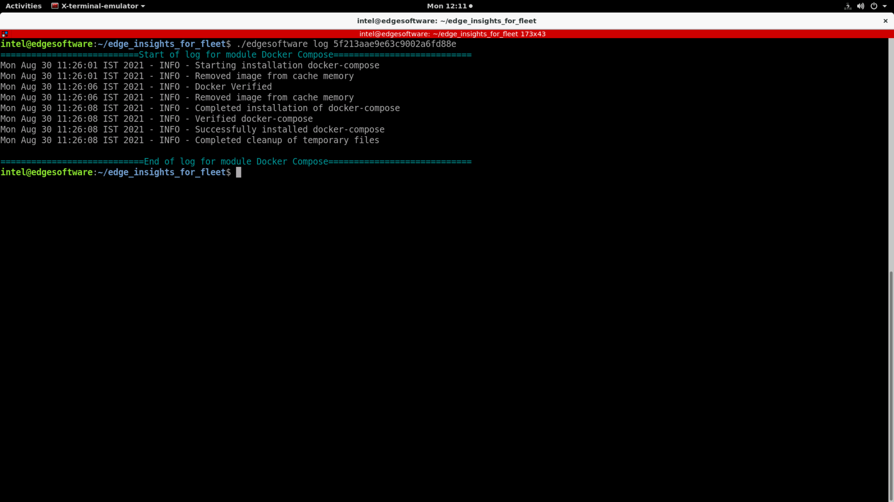

.. _intro-to-edge-software-cli:

Introduction to the Edge Software Command Line Interface (CLI)
==============================================================

edgesoftware is a command line interface (CLI) that helps you manage
packages on the Intel® Developer Catalog.

This guide describes the CLI commands and their usage. In this guide you
will:

-  Try out commands and get familiar with the CLI and the package you
   installed.
-  Learn to update modules.
-  Learn to install custom components.
-  Learn to export the package you installed, including custom modules,
   so you can install it on other edge nodes.

Get Started with the edgesoftware CLI
-------------------------------------

Use the information in this section to try out the edgesoftware CLI
commands.

To begin:

#. Open a terminal window.
#. Go to the ``edge_insights_for_fleet/`` directory.
#. Try out the following commands.

**Get Help or List the Available Commands**

-  Command:

   .. code-block:: bash

      ./edgesoftware --help

-  Response:

   .. code-block:: bash

      Usage: edgesoftware [OPTIONS] COMMAND [ARGS]...
      A CLI wrapper for management of Intel® Edge Software Hub packages

      Options:
        -v, --version   Show the version number and exit.
        ––help          Show this message and exit.

      Commands:
        download  Download modules of a package.
        export    Exports the modules installed as a part of a package.
        install   Install modules of a package.
        list      List the modules of a package.
        log       Show log of CLI events.
        pull      Pull Docker image.
        uninstall Uninstall the modules of a package.
        update    Update the modules of a package.
        upgrade   Upgrade a package. 

**Download Package Modules**

-  Command:

   .. code-block:: bash

       ./edgesoftware download

-  Response: Downloads and unzips the modules of the package. |image1|

**View the Software Version**

-  Command:

   .. code-block:: bash

      ./edgesoftware --version

-  Response: The edgesoftware version, build date, and target OS.

**List the Package Modules**

-  Command:

   .. code-block:: bash

      ./edgesoftware list

-  Response: The modules installed and status.
   |image2|

**List Modules Available for Download**

-  Command:

   .. code-block:: bash

      ./edgesoftware list --default

-  Response: All modules available for download for that package
   version, modules ID and version. |image3|

**Display the CLI Event Log**

-  Command:

   .. code-block:: bash

      ./edgesoftware log

-  Response: CLI event log information, such as:

   -  target system information (hardware and software)
   -  system health
   -  installation status
   -  modules you can install

   |image4|

**See the Installation Event Log for a Module**

-  Command:

   .. code-block:: bash

      ./edgesoftware log <MODULE_ID>

   You can specify multiple ``<MODULE_ID>`` arguments by listing them
   with a space between each.

   .. note::

      To find the module ID, use:
      .. code-block:: bash

         ./edgesoftware list

-  Response: The installation log for the module. |image5|

Install Package Modules
-----------------------

This edgesoftware command installs package modules on the target system.
To do so, the command looks at ``edgesoftware_configuration.xml`` that
was downloaded from the Intel® Developer Catalog when you installed the
Edge Insights for Fleet software. This file contains information about
the modules to install.

During the installation, you will be prompted to enter your product key.
The product key is in the email message you received from Intel
confirming your Edge Insights for Fleet download.

.. note::

   .. rubric:: Important
      :class: NoteTipHead

   Do not manually edit ``edgesoftware_configuration.xml``.

#. Open a terminal window.

#. Go to the ``edge_insights_for_fleet/`` directory.

#. Run the install command:

   .. code-block:: bash

      ./edgesoftware install

Update the Package Modules
--------------------------

.. note::

   On a fresh Linux installation, you might need to use the ``install``
   command at least once before performing an update. ``install`` makes
   sure all dependencies and packages are installed on the target
   system.
   .. code-block:: bash

      ./edgesoftware install

When you are ready to perform the update, use:

.. code-block:: bash

   ./edgesoftware update <MODULE_ID>

During the installation, you will be prompted to enter your product key.
The product key is in the email message you received from Intel
confirming your Edge Insights for Fleet download.

.. note::

   To find the module ID, use:
   .. code-block:: bash

      ./edgesoftware list --default

Export the Package for Installation
-----------------------------------

The edgesoftware CLI lets you package the installed modules, customer
applications, and dependencies as part of a package. The export is
provided in a ``.zip`` file that includes installation scripts, XML
files, and an edgesoftware Python\* executable.

Command:

.. code-block:: bash

   ./edgesoftware export

Uninstall the Packages
----------------------

The edgesoftware CLI lets you uninstall the complete package or
individual components from the package.

To uninstall an individual package, run the following command:

.. code-block:: bash

   ./edgesoftware uninstall <MODULE_ID>

To uninstall all the packages, run the following command:

.. code-block:: bash

   ./edgesoftware uninstall -a

.. note::

   This command will not uninstall Docker\* Compose and Docker Community
   Edition CE.

