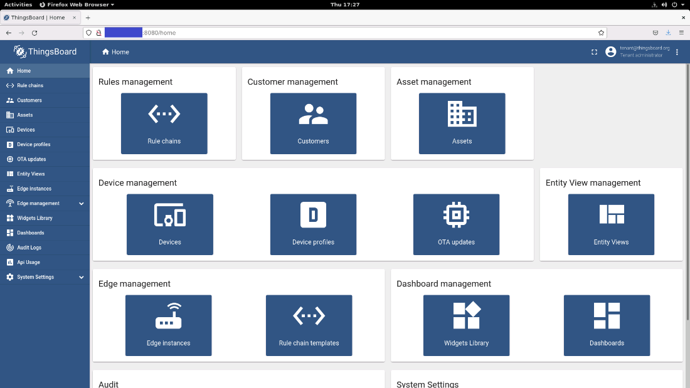

.. _set-up-thingsboard-local-cloud-data:

Set Up ThingsBoard\* Local Cloud Data
=====================================

To access the cloud data feature, you need to create a ThingsBoard\*
server on your local machine that will provide the possibility to have
application monitoring dashboard.

The reference implementations can connect with the ThingsBoard service
to send data such as alerts, Driver's drowsiness, driver name or driving
mode.

If you have AWS S3 Bucket setup you will be able to see and play also
the videos uploaded by the Reference Implementation.

At the end of the setup you will have Thingsboard_Access_Token,
Thingsboard_link_or_ip and Thingsboard_port to be used on on your Edge
Insights for Fleet Reference Implementation Cloud Data - Configuration.

To enable this feature you will need to install the package on your
machine or on local area network machine.

.. _set-up-tb-installation:

Installation
------------

#. From a terminal window, create a folder called ``thingsboard``:

   .. code-block:: bash

      mkdir thingsboard

#. Change directory to ``thingsboard``:

   .. code-block:: bash

      cd thingsboard

#. Using your preferred file editor, create a file called
   ``docker-compose.yml`` and add the following contents:

   .. code-block:: bash

      version: '2.2'
      services:
        mytb:
          restart: always
          image: "thingsboard/tb-postgres"
          ports:
            - "8080:9090"
            - "1883:1883"
            - "31000:7070"
            - "5683-5688:5683-5688/udp"
            - "31001:5432"
          environment:
            TB_QUEUE_TYPE: in-memory
          volumes:
            - ~/.mytb-data:/data
            - ~/.mytb-logs:/var/log/thingsboard

#. Create folders for the ThingsBoard database and logs:

   .. code-block:: bash

      mkdir ~/.mytb-data
      mkdir ~/.mytb-logs

#. Change user and group permissions to let ThingsBoard access those two
   folders:

   .. code-block:: bash

      sudo chown 799:799 ~/.mytb-data
      sudo chown 799:799 ~/.mytb-logs

#. Pull the Dockerhub image: (If your user is not on docker group, use
   sudo.)

   .. code-block:: bash

      docker-compose -f docker-compose.yml pull

#. Start the ThingsBoard server with the command:

   .. code-block:: bash

      docker-compose -f docker-compose.yml up -d

#. In about 2-3 minutes, you should be able to access the ThingsBoard
   page.

   a. Go to your preferred browser and access
      ``http://<host_ip>:8080/login``

   b. Login with the default user and password setup by the public
      Docker image:

      .. code-block:: bash

         User: tenant@thingsboard.org
         Password: tenant

ThingsBoard\* Cloud Setup
-------------------------

Devices and device profile setup:

#. First we need to create the Device and Device Profile.

#. Open the **Devices** tab from the main page or from the list on the
   left.

   .. image:: images/GUID-04099A18-16B8-4CBF-A0A8-FC04CA5AC834-low.png

#. Click on **+** and then click on **Add new device**.

#. A pop-up window with **Add new device** title will be seen.

#. If this is the first device, select **Create new device profile**.

   Enter the Device profile name using the format **truck<name>**, where
   **<name>** is user-defined.

   .. note::

      Make sure that the Device profile name includes **truck**, for
      example: **truck1** or **truck_1**.

   .. image:: images/GUID-D221771F-4BFC-4006-8B9B-D3FDCB64DAB0-low.png

#. Click on **Credentials** to open the Credentials tab.

#. Click on **Add credentials options**.

#. Set up a token for this device. Save this token to use on the
   Reference Implementations you have installed on the **Cloud Data ->
   Configuration** tab.

#. Click on **Add** to finish.

.. note::

   If you want to have multiple **truck** devices for Edge Insights for
   Fleet Reference Implementations, you just need to create a new one,
   assign the **truck** device profile to it and set an access token.

Import a Dashboard
------------------

This setup will provide the steps to import a template dashboard on your
ThingsBoard Cloud Setup.

If you have the AWS\* Cloud Storage setup, you should complete the
**Cloud Data -> Configuration** in order to have your **Thingsboard**
Server connected with AWS. This allows access to multimedia files
(videos or snapshots) uploaded by the Reference Implementation on your
AWS S3 Bucket server.

#. Open the **Dashboards** page from the main page or from the list on
   the left.

#. Click on **+** and select **Import Dashboard**.

   .. image:: images/GUID-57A66A65-6161-42D3-A234-D5AD0D1A5577-low.png

#. A pop-up window will appear to drop the json file or click to select
   the file.

#. Click on the area and in your installation folder, go to the
   following path:

   .. code-block:: bash

      <install_path>/<package_name>/<package_name><version>/<use_case_folder>/src/webui/templates 

   For example:

   .. code-block:: bash

      /home/intel/driver_behavior_analytics/Driver_Behavior_Analytics_2021.3/Driver_Behavior_Analytics/EII-DriverBehavior-UseCase/src/webui/templates/

#. Select the ``tb_dashboard.json`` file and click on the **Import**
   button.

#. The Intel Fleet Manager Dashboard should be visible on your
   dashboards list.

#. To open a dashboard, you have to click on the following icon:

   .. image:: images/GUID-8883B036-B595-45DB-A514-9E9EED932BE1-low.png

#. Your dashboard should automatically map the truck device you have
   previously created.To activate the Reference Implementation
   monitoring, you will need to complete the **Cloud Data ->
   Configuration** and **Run the Use** case.

#. On the dashboard, click on the device you configured for your
   Reference Implementation.

   For example, if you added the **truck1** access token to your RI and
   you started the use case, then click on **truck1** inside the
   dashboard in order to see the data live.

   .. image:: images/GUID-9AD3B27B-36D4-448C-8EAB-89FF236C8599-low.png

Troubleshooting
---------------

If you don't have access to the ThingsBoard web page, you may need to
change the port forwarding inside the ``docker-compose.yml`` file.

Follow these steps:

#. Run the following command to stop ThingsBoard server:

   .. code-block:: bash

      docker-compose -f docker-compose.yml down

#. Modify the ``docker-compose.yml`` file with your port forwarding
   setup. The left side ports are used on your host.

   .. code-block:: bash

      - "8080:9090"
      - "1883:1883"
      - "7070:7070"
      - "5683-5688:5683-5688/udp"
      - "30000:5432"

   For example, if port 8080 is blocked, your new port forwarding
   configuration for this port could be:

   .. code-block:: bash

      - "30300:9090"

   The server will access 8080 port inside the Docker container and it
   will forward the data to port 30300 on your host machine.

#. Save the file and re-run the command to start the server:

   .. code-block:: bash

      docker-compose -f docker-compose.yml up -d

