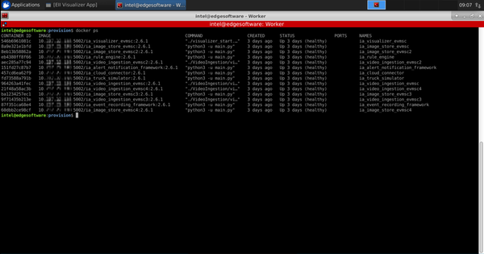

.. _update-an-application-over-the-air:

Update an Application-Over-The-Air
==================================

**Application-Over-The-Air (AOTA)** updates enable cloud to edge
manageability of application services running on Edge Insights for Fleet
(EIF) enabled systems through the Device Manageability component. Device
Manageability is a Device Manageability Software which includes SOTA,
FOTA, AOTA, and few system operations.

For EIF use case, only AOTA features from Device Manageability are
validated and will be supported through ThingsBoard\* cloud-based
management front-end service.

The following section will walk you through setting up ThingsBoard*,
creating and establishing connectivity with the target systems, as well
as updating applications on those systems.

.. note::

   Device manageability was previously named Turtle Creek. Remnants of
   the previous name still exists in some components. The name
   replacement is ongoing and will be completed in future releases.

Install Device Manageability Functionality
------------------------------------------

You need 2 hosts to run AOTA. One host is the server on which an EIF
Reference Implementation will be installed, and one host is the worker
on which the Reference Implementation will be deployed through AOTA for
execution.

In this guide, the server host will be referred to as *Server* and the
worker host will be referred to as *Worker*.

Similarly, ``$BUILD_PATH`` refers to the build ingredients directory of
EIF where most of the commands will be executed. Depending on which EIF
Reference Implementation is installed, ``$BUILD_PATH`` has the following
form:
``/path/to/<RI_name>/<RI_name><release_version>/IEdgeInsights/build``.
For the exact value of ``<RI_name>`` and ``<release_version>`` for your
setup, refer to the respective Reference Implementation documentation.

**Server Prerequisites**

#. Refer to :ref:`requirements` for the hardware requirements.

#. Ubuntu\* 18.04.3 LTS

#. One of the EIF :ref:`reference-implementations` is installed.

**Worker Prerequisites**

#. Refer to :ref:`reference-implementations` for the specific hardware
   requirements for the worker host.

#. Ubuntu\* 18.04.3 LTS

#. Install the latest Docker cli/Docker daemon by following sections
   **Install using the repository** and **Install Docker Engine** at:
   https://docs.docker.com/engine/install/ubuntu/#install-using-the-repository

   Run Docker without sudo following the **Manage Docker as a non-root
   user** instructions at:
   https://docs.docker.com/engine/install/linux-postinstall/.

#. If your Worker is running behind a HTTP/S proxy server, perform these
   steps. If not, you can skip this step.

   a. Configure proxy settings for the Docker\* client to connect to
      internet and for containers to access the internet by following
      the details at: https://docs.docker.com/network/proxy/.

   b. Configure proxy settings for the Docker\* daemon by following the
      steps at:
      https://docs.docker.com/config/daemon/systemd/#httphttps-proxy.

#. Install the docker-compose tool by following the steps at:
   https://docs.docker.com/compose/install/#install-compose.

All Device Manageability devices can be controlled using a correctly set
up cloud service application. Follow the steps below to install Device
Manageability on Server:

#. Go to the manageability folder and run the commands:

   .. code-block:: bash

      sudo chmod 775 install_tc.sh 
      sudo ./install_tc.sh 

   .. note::

      The manageability folder should be
      ``$BUILD_PATH/../../manageability/`` for an EIF Reference
      Implementation.

#. After reading all the licenses, press ``q`` once to finish.

#. Accept the License by typing ``Y``

   After installation is complete, you should see terminal output
   similar to the following:

   .. image:: images/GUID-32EF2676-AEB4-4C41-A8F1-9914EF85774A-low.png

#. Once Device Manageability has been installed successfully, edit the
   ``/etc/intel_manageability.conf`` file and update the required
   values.

   .. code-block:: bash

      sudo vi /etc/intel_manageability.conf

   a. Under the ``<all> </all>`` section, change dbs from ON to OFF.

      DBS stands for Docker\* Bench Security. This feature of Device
      Manageability is not used for EIF.

      .. image:: images/GUID-6CB60C38-3D44-4995-858A-9E342F50E40E-low.png

   b. Add the IP endpoint for the developer files to the
      trustedRepositories:

      .. code-block:: bash

         <trustedRepositories>
          http://[Server_IP]:5003 
         </trustedRepositories

   c. Save and exit. You must restart the Server before these changes
      can take effect.

Repeat these steps on the Worker machine. Create an archive with the
manageability folder from step 1, copy it on the Worker machine, and
repeat the installation steps.

Multi-Node Deployment
---------------------

EIF deployment on multiple nodes requires the use of the Docker\*
registry. The following sections outline some of the commands to be run
on the Server and on any newly added Workers.

Execute the following steps on the Server.

**Configure Docker\* Registry**

#. Launch the local Docker\* registry:

   .. code-block:: bash

      docker run -d -p 5002:5000 --name registry --restart unless-stopped registry:2

#. Update the Docker\* registry URL in the ``DOCKER_REGISTRY`` variable,
   with the ``localhost:5002/`` value:

   .. code-block:: bash

      sudo vi $BUILD_PATH/.env

#. Identify the images that need to be tagged:

   .. code-block:: bash

      cat docker-compose-push.yml | grep container_name

#. Identify the version of the Docker\* images:

   .. code-block:: bash

      docker images | <docker_image_from_above_command>

#. Tag each image with the following command:

   .. code-block:: bash

      docker tag <docker_image>:<version> localhost:5002/<docker_image>:<version>

   .. image:: images/GUID-02A62BA1-0D95-47BC-B200-46D9EAC0AA6E-low.png

#. Push the Reference Implementation images to the registry:

   .. code-block:: bash

      docker-compose -f docker-compose-push.yml push

#. Identify the names and versions, and tag the etcd and etcd_provision
   images too, as shown above:

   .. code-block:: bash

      docker images | grep etcd

#. Push the etcd and etcd_provision images to the Docker\* registry:

   .. code-block:: bash

      docker push localhost:5002/<image_name>:<version>

   .. image:: images/GUID-C784EB8B-F543-4745-B218-43B8A5BFF984-low.png

**Configure ETCD\* as leader**

#. Update the ``ETCD_HOST`` variable with the IP of Server, and
   ``ETCD_NAME`` variable with value ``leader`` in the ``.env`` file:

   .. code-block:: bash

      sudo vi $BUILD_PATH/.env

#. Run the provisioning script:

   .. code-block:: bash

      cd $BUILD_PATH/provision
      sudo ./provision ../docker-compose.yml

**Generate the provisioning bundle**

#. Update the Docker\* registry URL in ``DOCKER_REGISTRY`` variable,
   with the IP of Server and port 5002, <Server_IP>:5002/ , and
   ``ETCD_NAME`` variable with the ``worker`` value:

   .. code-block:: bash

      sudo vi $BUILD_PATH/.env

#. Generate the provisioning archive:

   .. code-block:: bash

      cd $BUILD_PATH/deploy/
      sudo python3 generate_eii_bundle.py -p

.. note::

   This command will generate a ``worker_provisioning.tar.gz`` archive.
   Save this archive. It will be deployed on the Worker in the following
   steps.

**Generate the AOTA bundle**

#. Identify the list of services that need to be configured:

   .. code-block:: bash

      cat ../config_all.yml | grep ia_

#. Edit the ``config.json`` file and replace the ``include_service``
   list with the list of services from above command:

   .. code-block:: bash

      sudo vi config.json

#. Generate the eii_bundle archive that will be used to launch AOTA.

   .. code-block:: bash

      sudo python3 generate_eii_bundle.py

.. note::

   This command will generate a ``eii_bundle.tar.gz`` archive. Save this
   archive. It will be served through a Python\* HTTP server and
   ThingsBoard\* to the Worker to launch AOTA.

Cloud Service: ThingsBoard\* Setup
----------------------------------

Follow these instructions to set up ThingsBoard on the Server. It is
possible to set up ThingsBoard on a different host, even one that is not
part of the cluster, however, this tutorial describes how to deploy it
on the Server.

#. Follow the :ref:`Installation section of Set Up ThingsBoard Local Cloud Data
   <set-up-tb-installation>`.

#. On the ThingsBoard\* page, go to **Devices**, add a new device with
   name **Worker** and a new profile with profile name **INB**.

   .. image:: images/GUID-8E10C3CF-AFCA-42EF-804D-71D9AE10D9FE-low.png

#. On the device list, click on the shield icon to find out the
   credentials of this device:

   .. image:: images/GUID-CECFBE72-31A1-4032-BD4B-DC91CCAA982E-low.png

#. Save the credentials for Worker provisioning. In this dialog you have
   the option to add a custom Access Token instead of using the provided
   one. Do not forget to click the **Save** button if you modify the
   Access Token.

   .. image:: images/GUID-95B0E662-1F18-42EC-B862-614C728DA8D0-low.png

#. Set up the **AOTA** dashboard:

   a. Go to the Widgets Library in the ThingsBoard\* menu.

   b. Click on the **+** button and select **'Imports widgets bundle'**.

   c. Browse to ``/usr/share/cloudadapter-agent/thingsboard/`` and
      select the ``intel_manageability_widgets_version_3.3.json`` file.

   d. Click the **Import** button.

      .. image:: images/GUID-F3C7FD3F-C630-42C4-A4DA-CEBA78BAEE5F-low.png

   e. Go to **Dashboards** in the ThingsBoard\* menu.

   f. Click on the **+** button and select **Import dashboard**.

   g. Browse to ``/usr/share/cloudadapter-agent/thingsboard/`` and
      select the ``intel_manageability_devices_versoin_3.3.json`` file.

   h. Click the **Import** button.

      .. image:: images/GUID-7ED7E871-D4A2-4CBF-AF58-6445D22B699D-low.png

Worker Provisioning
-------------------

With the Server and the Cloud Service set up, in this section you will
set up the Worker. All the steps and commands in this section must be
executed on the Worker.

**Docker\* Provisioning**

#. Copy the ``worker_provisioning.tar.gz`` archive created in the
   `Multi-Node
   Deployment <#GUID-E2C87D75-A124-4392-B38E-E777B50E6016>`__ section to
   the Worker host.

#. Untar the archive:

   .. code-block:: bash

      tar -xf worker_provisioning.tar.gz

#. Run the provisioning script:

   .. code-block:: bash

      cd worker_provisioning/provision
      sudo ./provision.sh

#. Configure the Docker\* daemon to allow pulling images from Server:

   a. Edit the ``/etc/docker/daemon.json`` file:

      .. code-block:: bash

         sudo vi /etc/docker/daemon.json

   b. Add the following lines:

      .. code-block:: bash

         {
             “insecure-registries”: [“<Server_IP>:5002”]
         }

   c. Restart the Docker service to reload the change:

      .. code-block:: bash

         sudo service docker restart

**ThingsBoard\* Provisioning**

#. Add the **DISPLAY** variable to the ``/etc/environment`` file.

   .. image:: images/GUID-FEA42DC5-3031-4836-AB9F-08247A0856D9-low.png

   Update the value according to your environment.

#. Launch the provisioning binary:

   .. code-block:: bash

      sudo PROVISION_TPM=auto provision-tc

#. If the Worker was previously provisioned, the following message will
   appear. To override the previous cloud configuration, enter ``Y``.

   .. image:: images/GUID-C57A28C3-EBB4-437A-B28C-3648453A0E0E-low.png

#. Select ThingsBoard\* as the cloud service by entering **3** and
   **Enter**.

#. Provide the IP of the Server:

#. When asked for the server port, press **Enter** to use the default
   value **1883**.

#. When asked about provision type, choose **Token Authentication**.

#. Enter the device token extracted in the `Cloud Service: ThingsBoard\*
   Setup <#GUID-E6973BDD-AC9A-4A1D-9417-515FD57E236D>`__ section.

#. When asked about **Configure TLS**, enter **N**.

#. When asked about signature checks for OTA packages, enter **N**.

   .. image:: images/GUID-E88D37B3-47A5-41F3-9E85-479F19C67893-low.png

   The script will start the Intel® Manageability Services. When the
   script finishes, you will be able to interact with the device via the
   ThingsBoard\* dashboard.

If at any time the cloud service configuration needs to be changed or
updated, you must run the provisioning script again.

**Configure Reference Implementation**

#. Create the necessary folders and files for the Reference
   Implementation configuration:

   .. code-block:: bash

      sudo mkdir -p /opt/intel/eii/local_storage
      sudo touch /opt/intel/eii/local_storage/credentials.env
      sudo touch /opt/intel/eii/local_storage/cloud_dashboard.env
      sudo mkdir /opt/intel/eii/local_storage/saved_images
      sudo mkdir /opt/intel/eii/local_storage/saved_videos
      sudo chown eiiuser:eiiuser -R /opt/intel/eii

#. Add the AWS\* cloud credentials and ThingsBoard\* credentials into
   ``credentials.env`` and ``cloud_dashboard.env``, created above. These
   are the credentials that you would usually add into the Configuration
   page of the webpage of the Reference Implementation:

   .. image:: images/GUID-9026D976-E85C-469B-96A3-5D344E75E4BA-low.png

   a. In the ``/opt/intel/eii/local_storage/credentials.env`` file, add
      the following variables along with the values you would've added
      in the webpage for AWS\* credentials:

      .. code-block:: bash

         AWS_ACCESS_KEY=
         AWS_SECRET_ACCESS_KEY=
         AWS_BUCKET_NAME=

   b. (Optional) In the
      ``/opt/intel/eii/local_storage/cloud_credentials.env`` file, add
      the following variables along with the values you would've added
      in the webpage for ThinbsBoard\* credentials:

      .. code-block:: bash

         HOST=
         PORT=
         ACCESS_TOKEN=

      This step is optional. It must be executed if you wish to continue
      receiving updates in the cloud dashboard and have the Reference
      Implementation save the events on AWS\* storage.

Perform AOTA
------------

In the `Multi-Node
Deployment <#GUID-E2C87D75-A124-4392-B38E-E777B50E6016>`__\ section you
created the **AOTA**\ ``eii_bundle.tar.gz`` bundle.

On the Server, go to the path where that file is located, and, for
development purposes only, launch a Python\* HTTP server:

.. code-block:: bash

   python3 -m http.server 5003

#. Go to ThingBoard\* page, **Dashboard**, and select **INB-Intel
   Manageability Devices**:

   .. image:: images/GUID-AA653314-BE33-4C3F-9890-2A5F5E662CB1-low.png

#. Click on the **Trigger AOTA** button:

   .. image:: images/GUID-E2F80871-5D76-41DD-B9C5-D673720FED33-low.png

#. Once the Trigger AOTA dialog opens, complete each field per
   information below:

   .. image:: images/GUID-12EB4657-A11B-4BC7-AA50-BA6148993923-low.png

   **App:** docker-compose

   **Command:** up

   **Container Tag:** eii_bundle

   **Fetch:** enter the HTTP server that was set up at the start of this
   section.

   Leave the other sections empty and click on the **Send** button.

   In the step above, the Worker will access the Server through the
   local HTTP server to fetch the eii_bundle.

   In the ThingsBoard\* log, you can see that eii_bundle was fetched
   from the local server and was deployed successfully:

   .. image:: images/GUID-B9C377A9-DED0-4AD4-8172-7867A9A0A9B6-low.png

.. note::

   To stop the application on Worker, trigger another AOTA event and set
   **Command** to **down** instead of **up**.

To verify that the EIF Reference Implementation was successfully
deployed on the new node, check the list of running containers with the
command:

.. code-block:: bash

   docker ps

The output will be similar to the following snapshot:

As the Reference Implementation is launched with test videos, which are
available only on the Server and are not deployed on Worker, it will
crash on first launch. To fix this, you need to find out what test video
needs to be copied from the Server to the Worker and where.

To find out which video to copy, first identify all the Video
Ingestors/Analytics Docker\* images that were launched for the RI with
the command above, and for each of them run the following command:

.. code-block:: bash

   docker logs <container_id>

You will see output similar to:

To identify the location where these videos need to be copied, run the
command for each container as above:

.. code-block:: bash

   docker inspect -f ‘{{ .Mounts }}’ <container_id>

You will see output similar to:

The name will be different based on the installed Reference
Implementation.

The videos were deployed along with the Reference Implementation on the
Server. Search for them in the installation folder and copy them to the
folder shown above. Once the videos are in the right place, trigger AOTA
with 'down' event and another one with 'up' event.

If the Visualizer does not appear, run the following command:

.. code-block:: bash

   xhost +

**Verify Triggered AOTA in Event**

Once the AOTA event is triggered, you can verify the log of the
triggered call. This can be one of the verification tasks done during
the development phase.

#. Go to Worker and run the following command to see the logs:

   .. code-block:: bash

      journalctl -fu dispatched * journalctl -fu cloudadapter

#. Note the event logs on the ThingsBoard\* server show which commands
   have been run.

If the event log does not appear, follow these steps:

-  Change settings from ERROR to DEBUG everywhere in these files:

   .. code-block:: bash

      /etc/intel-manageability/public/dispatcher-agent/logging.ini
      /etc/intel-manageability/public/cloudadapter-agent/logging.ini

-  Run the commands:

   .. code-block:: bash

      sudo systemctl restart dispatcher
      sudo systemctl restart cloudadapter

